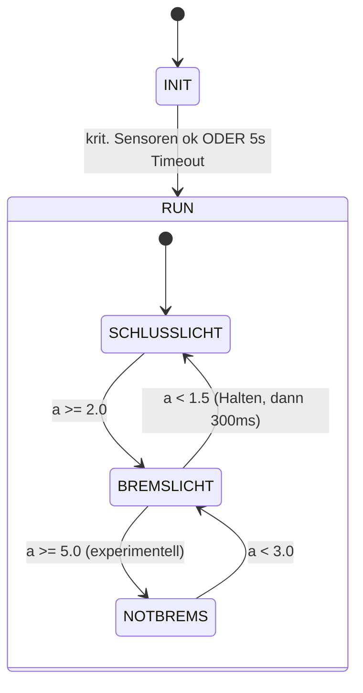
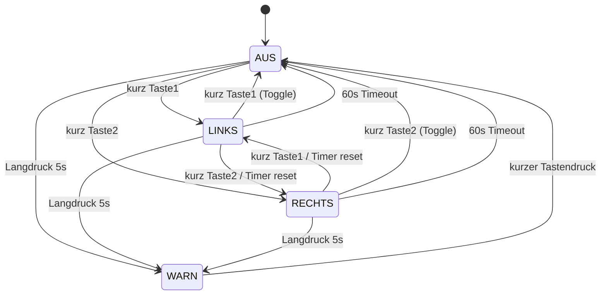

# Project Bible — Smartes Fahrrad-Rücklicht
**Bachelorarbeit Krahl · Maschinenbau & Produktentwicklung (B.Eng.)**
**Version 0.18 · Stand 09.08.2026 · Status: aktiv gepflegt (Single Source of Truth)**

> Diese Project Bible ist die oberste Wissensinstanz des Projekts. Bei Widersprüchen zwischen Chat-Historie und Project Bible gilt ausschließlich die Project Bible. Chats dienen der Diskussion und Entscheidungsfindung; der offizielle Projektstand steht ausschließlich hier.

---

## 0. Meta & Änderungsprotokoll

### 0.1 Geltungsregeln
- Die Project Bible bildet jederzeit den offiziellen Entwicklungsstand des Gesamtsystems ab.
- Widerspricht eine frühere Chat-Aussage der Project Bible, gilt die Project Bible.
- Kapitel 10 (Entwicklungsentscheidungen) wird als lebendes Änderungsprotokoll geführt.
- Trennung der Ebenen: **Project Bible** = offizieller Stand · **Kapitel 10** = Begründung der Entscheidungen · **Chats** = Diskussion.

### 0.2 Kennzeichnungslegende
- **[gesichert]** — durch mehrere Quellen bestätigt oder vom Nutzer freigegeben.
- **[Annahme]** — plausibel, aber messtechnisch/dokumentarisch noch nicht verifiziert.
- **[offen]** — in Klärung, noch nicht entschieden.
- **[geplant]** — beschlossen und spezifiziert, aber noch nicht umgesetzt oder noch nicht verifiziert.

### 0.3 Änderungsprotokoll
| Version | Datum | Änderung | Anlass |
|---|---|---|---|
| 0.1 | 21.07.2026 | Erstkonsolidierung als Analysedokument. | Projektaufnahme |
| 0.2 | 21.07.2026 | 12-Kapitel-Zielstruktur. SRS-Block A. | Freigabe Block A |
| 0.3 | 21.07.2026 | SRS-Block B (Zustandsmodell). | Freigabe Block B |
| 0.4 | 21.07.2026 | SRS-Block C (Detaillogik); Norm-Grundlage § 67/ECE. | Freigabe Block C |
| 0.5 | 21.07.2026 | SRS-Block D + E (Fehler & Sicherheit). | Freigabe Block D+E |
| 0.6 | 21.07.2026 | SRS-Block F (nichtfunktional); Akku LP103454. | Freigabe Block F |
| 0.7 | 21.07.2026 | SRS-Block G + H. **SRS (Phase 1) vollständig.** | Freigabe Block G+H |
| 0.8 | 21.07.2026 | Phase 3: Monorepo + PlatformIO angelegt, Umgebung lauffähig (pioarduino, Core 3.3.11). | Setup abgeschlossen |
| 0.9 | 21.07.2026 | M1 (Rücklicht-Region R2) in Umsetzung: FSM + Host-Tests. Detailklarstellungen FR-TL-03, FR-TL-06, FR-TL-07. | Implementierung M1 |
| 0.10 | 26.07.2026 | Implementierungsstand M1–M4 hardwarevalidiert, M5 Teil A (BMP280) validiert; zentrale I²C-Bus-Initialisierung; BMP280 FORCED-Mode. | Impl. M1–M5A |
| 0.11 | 29.07.2026 | App-Plattform: native iOS-App (Core Bluetooth) statt Web-App/PWA. | Plattform-Entscheidung App |
| 0.12 | 30.07.2026 | BLE-Brownout-Fallstudie; Board-Wechsel auf Espressif ESP32-DevKitC-32E beschlossen. | Root-Cause-Analyse BLE-Brownout |
| 0.13 | 01.08.2026 | Board-Tausch ausgeführt und validiert; iOS-App-Stand nachgezogen. | BLE-Validierung + App-Stand |
| 0.14 | 05.08.2026 | Telemetrie-Frame um `brake_light_pct` erweitert, 80→81 Byte, Schema-Version 1→2. | Frame-Erweiterung |
| 0.15 | 05.08.2026 | Serial-Bench-Validierung der Bremslicht-Logik; iOS-App am realen iPhone verifiziert. | Bench-Validierung |
| 0.16 | 06.08.2026 | **Feldtest 06.08.2026:** IMU-Bremserkennung im Realbetrieb falsifiziert (r = −0,132, n = 939). Ursache analytisch belegt. Neues Kap. 9.4. Architekturentscheidung V-B. | Feldtest-Auswertung |
| **0.17** | **09.08.2026** | **Große Revision. (a) Stufe 1 (`motion_filter`, Normbetrags-Gate) implementiert, host-getestet und am 08.08.2026 im Feld verifiziert — die Bremserkennung funktioniert; neues Kap. 9.5. Der Validierungsstatus von `motion_filter` wird von „im Feld falsifiziert" auf „im Feld verifiziert" heraufgestuft. (b) Zwei neue Firmware-Befunde: die Mindesthaltezeit nach FR-TL-06 ist im Fahrbetrieb unwirksam (Mangel), und `brake_decel_ms2` trägt eine geschwindigkeitsabhängige Grundlinie (quantifizierte Grenze). (c) Zeitverhalten erstmals im Fahrbetrieb gemessen: 6,7 ms Worst Case statt 0,651 ms am Prüfstand. (d) Methodische Korrektur: die Zahl r = −0,132 aus v0.16 wurde ohne Berücksichtigung der Latenz der GNSS-Referenzkette gerechnet und ist als Gütemaß nicht belastbar. (e) Elektronik vollständig geklärt und dokumentiert: Schaltplan Rev. 1.0 erstellt (Kap. 5.4), sechs offene Verdrahtungspunkte geschlossen, Energiebilanz methodisch korrigiert (13 h → ~8 h), GNSS-Antenne als nicht verbaut erkannt. (f) Einbaulage der IMU um 180° gedreht; Achsentransformation spezifiziert, noch nicht implementiert.** | Messfahrt, Schaltplan, Verdrahtungsklärung |
| **0.18** | **09.08.2026** | **Korrektur der Schalterposition.** SW1 sitzt im **Akkupfad zwischen U1 OUT+ und U2 VIN+** und trennt damit den Eingang des Aufwärtswandlers — nicht, wie in v0.17 und im Schaltplan zunächst dargestellt, zwischen MT3608-Ausgang und 5-V-Schiene. Funktional bleibt die Wirkung gleich (die gesamte 5-V-Schiene ist stromlos), elektrisch ändert sich der Schalterstrom: er fließt nun auf der Akkuseite und beträgt im Worst Case 1,18 A statt 0,79 A. Neuer Befund B-6. Schaltplan Rev. 1.1, Kap. 4.1, 5.1, 5.2, 5.4, 11.2 und 12 angepasst. | Korrekturhinweis des Verfassers |

### 0.4 Datengrundlage
| Quelle | Zeitstempel | Aussagekraft |
|---|---|---|
| Projektübergabe-Dokument | „Stand Juni 2026" | Detaillierteste Einzelquelle der Frühphase |
| Repo `smart-bike-rearlight` (Monorepo, PlatformIO), Commit `1178017` | 07.08.2026 | Maßgeblicher Implementierungsstand |
| `firmware/include/pins.h`, `config.h` | Commit `1178017` | Verbindliche Pin- und Parameterquelle |
| **Verdrahtungsklärung mit dem Verfasser** | **09.08.2026** | **Sechs bis dahin offene Elektronikpunkte geklärt (Kap. 5)** |
| **Schaltplan Rev. 1.0 (`schaltplan_fahrrad_ruecklichtsystem.kicad_sch/.pdf`)** | **09.08.2026** | **Gültiger Zeichnungsstand; ersetzt Schaltplan v2** |
| ~~Schaltplan v2.pdf~~ | 20.05.2026 | **überholt** — an drei Stellen nachweislich falsch, nicht mehr verwenden |
| **Messfahrt-Export `SmartBikeRearLightFahrt202608082245.csv`** | **08.08.2026** | **Feldnachweis Stufe 1, Schema v3, 10 Hz** |
| Feldtest-Exporte 06.08.2026 (sechs CSV, Schema v2, 1 Hz) | 06.08.2026 | Vorher-Vergleich |
| `Uebersicht.xlsx` (BOM) | 17.02.2026 | Stückliste mit Preisen — korrekturbedürftig (Kap. 11) |
| Datenblätter (ESP32-WROOM-32E, BMP280, GY-521, IRLZ44N, MT3608, TP4056, **Quectel L86 Hardware Design V1.0**) | Herstellerstand | Referenzwerte |
| Nutzer-Lastenheft Firmware | 21.07.2026 | Funktionaler Zielumfang (Kap. 2) |
| § 67 StVZO / ECE R6 / ECE R50 (recherchiert) | 07/2026 | Normative Grundlage (Kap. 2.8) |

---

## 1. Projektübersicht

### 1.1 Ziel
Entwicklung eines funktionsfähigen Prototyps eines *Smart Bike Rear Light*. Das System fungiert als IoT-Gerät, das mittels IMU-gesteuerter Bremslichtfunktion, Funk-Blinkern (433 MHz) und einer Live-Datenschnittstelle (BLE → iOS-App) die Verkehrssicherheit und Datenaufzeichnung für Radfahrer verbessert.

### 1.2 Kurzbeschreibung
Ein ESP32 erfasst zyklisch Daten von GNSS (Quectel L86), Barometer (BMP280) und IMU (MPU-6050), steuert ein rotes Schluss-/Bremslicht (PWM) sowie gelbe Funk-Blinker und streamt Live-Telemetrie an eine native iOS-App, die Statistik, Sensorfusion und Visualisierung übernimmt.

### 1.3 MVP
Zuverlässige Sensorerfassung und -Streaming, funktionierendes Schluss-/Bremslicht (intensitätsabhängig), Funk-Blinker, BLE-Live-Anzeige der Basis-Kennzahlen. Details s. Kap. 2.4.

### 1.4 Future Work
Erweiterte Fahranalyse, Sensorfusion, Sicherheitsfunktionen, Pseudo-Leistung/Kalorien, automatische Blinker-Rückstellung, RF-Anlernmodus, GNSS-Warnanzeige, OTA-Updates. Details s. Kap. 2.4.

---

## 2. Anforderungen an die Firmware (SRS) — vollständig (Blöcke A–H)

### 2.0 Kennzeichnung & ID-Systematik
Anforderungs-IDs: `FR-<Subsystem>-NN` (funktional), `NFR-<Kategorie>-NN`, `CON-NN` (Randbedingung), `OUT-NN` (ausgeschlossen).
Subsystem-Kürzel: `SYS`, `TL`, `BLK`, `RF`, `SNS`, `TEL`, `STA`, `SAF`, `CFG`.
NFR-Kategorien: `RT`, `RES`, `PWR`, `TST`, `EXT`.

> **Bearbeitungsstand SRS:** **Alle Blöcke A–H freigegeben — SRS vollständig (21.07.2026).** A (2.1), B (2.6), C (2.7), D (2.6/2.7), E (2.9), F (2.10), G (2.11), H (2.12). Normative Grundlage in 2.8.

### 2.1 Systemgrenzen & Kontext — Block A

| ID | Anforderung | Status |
|---|---|---|
| FR-SYS-01 | Firmware = Datenerfassungs- und Echtzeitknoten. Alle kumulativen/fusionierten Kennzahlen werden in der App berechnet (Variante 2). | gesichert |
| FR-SYS-02 | Firmware liest GNSS, BMP280, MPU6050 zyklisch aus und stellt Rohmesswerte als Telemetrie bereit. | gesichert |
| FR-SYS-03 | Lokal nur echtzeit-/sicherheitsrelevante Größen: Bremslichtintensität aus IMU-Verzögerung, Blinkerzustand. | gesichert |
| FR-SYS-04 | Schnittstelle zur App unidirektional (ESP32 → App); keine Steuerbefehle über BLE. | gesichert |
| FR-SYS-05 | Blinkersteuerung ausschließlich über 433-MHz-Fernbedienung. | gesichert |
| FR-TL-01 | Rote LED = kombiniertes Schluss-/Bremslicht; Grundzustand dauerhaft gedimmtes Schlusslicht. | gesichert |
| FR-TL-02 | Bremslicht-Helligkeit steigt mit der Bremsintensität (Kennlinie FR-TL-06). | gesichert |
| CON-01 | Datensenke = App; Firmware speichert nicht dauerhaft, nur flüchtiger RAM-Ringpuffer (FR-TEL-04). | gesichert |
| OUT-01 | Keine Akkustandsanzeige/Batteriespannungsmessung in HW/FW. | gesichert |
| OUT-02 | Nicht im MVP: Auto-Helligkeit, Standlicht, Auto-Blinker-Rückstellung, Flash-Voll-Logging. | gesichert |

### 2.2 Datenkatalog — Rohmesswerte (Firmware liefert)
- **GNSS (L86):** Position, Geschwindigkeit, Heading, UTC-Zeit, Satellitenanzahl, HDOP, Höhe.
- **BMP280:** Luftdruck, Temperatur.
- **MPU-6050:** Beschleunigung (3 Achsen), Drehrate (3 Achsen).

### 2.3 Datenkatalog — abgeleitete Fahrdaten (App berechnet, FR-SYS-01)
- **aus GNSS:** aktuelle/Durchschnitts-/Höchstgeschwindigkeit, Distanz, Route, Fahrzeit, Bewegungsrichtung, Start-/Zielposition, Zwischenzeiten.
- **aus BMP280:** aktuelle Höhe, Höhenmeter bergauf/bergab, max./min. Höhe, Temperatur, durchschnittl. Steigung.
- **aus MPU:** Bremsvorgänge, Sprints, Kurvenwinkel/-anzahl, Lean Angle, Sturzerkennung, Schräglagen L/R.
- **Sensorfusion:** GNSS+MPU, GNSS+BMP, BMP+MPU, alle drei (Pseudo-Power → Kalorien, Trainingsintensität).

### 2.4 MVP- und Future-Work-Umfang (App-Anzeige)
**MVP:** aktuelle/Durchschnitts-/Maximalgeschwindigkeit, Distanz, Fahrzeit, Höhe, Höhenmeter, Satellitenanzahl, Bluetooth-Status. *(kein Akkustand, OUT-01.)*
**Future-Work:** erweiterte Fahranalyse, Sicherheitsfunktionen, Nice-to-have (Pseudo-Leistung, Kalorien, Höhenprofil, Bremsereignisse, Road-Quality, Fahrstilanalyse), RF-Anlernmodus, OTA.

### 2.5 Eingangs-Lastenheft
Vollständig in den SRS-Blöcken A–H formalisiert. Keine offenen Rohanforderungen mehr.

### 2.6 Zustandsmodell — Block B (+ D-Präzisierungen)
Vier parallele (orthogonale) Regionen (Statechart nach Harel; Diagramme in Kap. 6.6). Kritischer Sensor ist ausschließlich die IMU (MPU6050); GNSS und BMP280 optional.

| ID | Anforderung | Status |
|---|---|---|
| FR-STA-01 | Power-On → INIT. Übergang INIT→RUN, sobald kritische Sensoren (IMU) initialisiert sind oder Init-Timeout 5 s abgelaufen ist. | gesichert |
| FR-STA-02 | Bei Init-Timeout → degradierter RUN: rote LED dauerhaft Schlusslicht (§ 67 gewahrt). | gesichert |
| FR-STA-03 | Regionen 2–4 laufen unabhängig; Sensor-/Systemfehler erzwingt kein regionsübergreifendes Sperren. | gesichert |
| FR-TL-03 | Während INIT signalisiert die rote LED per Diagnose-Blinken (~2 Hz, Zeit-Duty 50 %, moduliert 0 %↔~50 %) die Nicht-Bereitschaft. | gesichert |
| FR-TL-04 | In RUN leuchtet die rote LED dauerhaft mindestens als gedimmtes Schlusslicht (~20 %). | gesichert |
| FR-TL-05 | Bremslicht ist temporäre Helligkeitsanhebung; nach Bremsende Rückfall auf Schlusslicht (Kennlinie FR-TL-06). | gesichert |
| FR-BLK-01 | Richtungsblinker per kurzem Tastendruck (T1=links, T2=rechts); erneuter kurzer Druck = aus (Toggle). | gesichert |
| FR-BLK-02 | Umschalten Links↔Rechts durch andere Taste; setzt 60-s-Timeout neu. | gesichert |
| FR-BLK-03 | Richtungsblinker: max. Blinkdauer 60 s → automatische Selbstabschaltung. | gesichert |
| FR-BLK-04 | Warnblinker durch Langdruck (≥ 5 s) einer beliebigen Taste; beide Seiten blinken; kein Timeout. | gesichert |
| FR-BLK-05 | Warnblinker endet durch beliebigen einzelnen kurzen Tastendruck → AUS. | gesichert |
| FR-BLK-06 | Links/Rechts gegenseitig verriegelt; WARN einziger Zustand mit beidseitigem Blinken. | gesichert |
| FR-BLK-07 | Kurz-/Langdruck-Diskriminierung: Loslassen < 5 s = Kurzdruck; Halten ≥ 5 s = Warnblinker. | gesichert |
| FR-BLK-09 | RF-Blinkerbefehle werden erst ab RUN wirksam; während INIT verworfen. | gesichert |
| FR-SNS-01 | Ab RUN werden GNSS, BMP280, MPU6050 zyklisch gesampelt — unabhängig vom BLE-Zustand. | gesichert |
| FR-TEL-01 | Bei BLE-Verbindung Telemetrie-Stream; ohne Verbindung RAM-Ringpuffer (FR-TEL-04). | gesichert |

### 2.7 Funktionale Detaillogik — Block C

| ID | Anforderung | Status |
|---|---|---|
| FR-TL-06 | Bremslicht-Kennlinie: Schlusslicht-Grundhelligkeit ~20 % PWM. Stetig-linearer Anstieg von 2,0 m/s² bis Sättigung 5,0 m/s² (100 %). Ausschalthysterese: Rückfall unter ~1,5 m/s². Mindesthaltezeit 300 ms. Anstieg schnell (Sicherheit). Eingang: gravitationskompensierte Längsverzögerung aus `motion_filter`. Norm-Anker ECE R50 (§ 67 Abs. 4). **Stand 09.08.2026:** Proportionalkennlinie bench- **und** feldvalidiert (Kap. 9.3/9.5; im Feld 194 von 194 Zeilen auf ±1 Prozentpunkt). Die Eingangsgröße ist seit Stufe 1 feldverifiziert (Kap. 9.5). **Die Mindesthaltezeit ist im Fahrbetrieb nachweislich unwirksam** — Mangel M-01, Kap. 9.5.4. | Kennlinie gesichert · Eingangsgröße feldverifiziert · **Mindesthaltezeit: Anforderungsabweichung** |
| FR-TL-07 | Notbrems-Blinken (ESS-Konzept): aktiviert ab ≥ 5,0 m/s², deaktiviert bei < 3,0 m/s². ~4 Hz, Zeit-Duty 50 %. **Experimentalfunktion, standardmäßig DEAKTIVIERT — nicht konform mit § 67 Abs. 4 StVZO.** | gesichert (experimentell) |
| FR-BLK-08 | Blinkfrequenz 1,5 Hz (ECE R6: 1,5 Hz ± 0,5), Duty 50 %, Hellzeit > 0,3 s. | gesichert |
| CON-02 | PWM-Trägerfrequenz aller LED-Kanäle 5 kHz, 8 bit Auflösung. | gesichert |
| FR-RF-01 | Kontinuierliche Überwachung GPIO4 (RCSwitch); nur bekannte Codes (T1=10967538, T2=10967537). | gesichert |
| FR-RF-02 | Druck erst nach ≥ 2 identischen Empfängen gültig (Entprellung/EMV). | gesichert |
| FR-RF-03 | Halte-Erkennung; „losgelassen" nach Empfangslücke > Release-Timeout (~150 ms, final nach Verifikationstest). | gesichert |
| FR-RF-04 | Kurzdruck (< 5 s) → SHORT; Halten ≥ 5 s → LONG (Warnblinker). | gesichert |
| FR-RF-05 | Reaktionszeit erkanntes Ereignis → LED < 100 ms. | gesichert |
| FR-RF-06 | RF-Codes fest im Code; Anlern-/Pairing-Modus → Future-Work. | gesichert |
| FR-SNS-02 | Sampling: IMU 100 Hz, BMP280 10 Hz, GNSS 1 Hz (ab RUN, unabhängig von BLE). | gesichert |
| FR-TEL-02 | Telemetrie-Frame 10 Hz, frischeste Werte + Status. | gesichert |
| FR-TEL-03 | Frame-Inhalt: IMU, BMP, GNSS, Status; ab Schema v3 zusätzlich GNSS-Referenzbeschleunigung, Filter-Innensicht und 100-Hz-Fensteraggregate. Kein Akkustand. | gesichert |
| FR-TEL-04 | Ohne BLE Pufferung im RAM-Ringpuffer; Überlauf überschreibt Ältestes. | gesichert |

### 2.8 Normative Grundlagen der Lichtfunktionen [recherchiert 07/2026]

| Norm | Gegenstand | Bezug im Projekt |
|---|---|---|
| § 67 Abs. 3 StVZO | Scheinwerfer: Blinken unzulässig | – |
| § 67 Abs. 4 StVZO | Rote Schlussleuchte (kein Blinken); Bremslichtfunktion zulässig (ECE R50) | FR-TL-01/04/06 konform; **FR-TL-07 Konflikt** |
| § 67 Abs. 5 StVZO | Fahrtrichtungsanzeiger zulässig, gelb/amber | FR-BLK-* |
| ECE R6 | Blinkfrequenz 1,5 Hz ± 0,5, Hellzeit > 0,3 s | FR-BLK-08 |
| ECE R50 | Schluss-/Bremslichtfunktion | FR-TL-06 |
| ECE R48 (nur Kfz) | Emergency Stop Signal — für Fahrräder nicht anwendbar | FR-TL-07 (Konzeptanker) |

Hinweis: Sekundärquellen; für die Thesis am Primärtext (§ 67) gegenprüfen. Keine Rechtsberatung.

### 2.9 Fehlerbehandlung & Sicherheit — Block E

| ID | Anforderung | Status |
|---|---|---|
| FR-SAF-01 | Fail-safe-Leitprinzip: Bei jedem erkennbaren Fehler bleibt das rote Schlusslicht an (§ 67). | gesichert |
| FR-SAF-02 | Funktionspriorität: Schlusslicht > Bremslicht > Blinker > Telemetrie. | gesichert |
| FR-SAF-03 | Task-Watchdog (~2 s), Reset bei Hang; Reset-Ursache als Diagnose-Flag. | gesichert |
| FR-SAF-04 | BLE-/Telemetrie-Fehler dürfen Licht/Blinker nicht beeinträchtigen. | gesichert |
| FR-STA-04 | Laufzeit-IMU-Ausfall → sicheres Schlusslicht, Fehler-Flag, Hintergrund-Reinit. | gesichert |
| FR-STA-05 | Ausfall optionaler Sensoren → Weiterbetrieb, Telemetriefelder ungültig markiert. | gesichert |
| FR-STA-06 | Kein harter FAULT im MVP; degradierter RUN mit Fehler-Flags. | gesichert |
| FR-SNS-03 | I²C-Zugriffe zeitbegrenzt (~25–50 ms), nicht-blockierend. | gesichert |
| FR-SNS-04 | Gestufte, nicht-blockierende I²C-Recovery. | gesichert |
| FR-SNS-05 | Leichte Plausibilitätsprüfung (Wertebereich + Eingefroren-Erkennung). | gesichert |
| FR-TEL-05 | GNSS-Status NO_DATA/NO_FIX/FIX_OK; Fix gültig wenn isValid & Alter < 3 s & Sats ≥ 4. | gesichert |

### 2.10 Nichtfunktionale Anforderungen — Block F

| ID | Anforderung | Status |
|---|---|---|
| NFR-RT-01 | Bremslicht-Reaktionszeit ≤ 50 ms (Ereignis → LED). | **erfüllt** (Bench: ≤ 10 ms, Kap. 9.3) |
| NFR-RT-02 | Blinktakt 1,5 Hz timer-basiert; Periodentoleranz ± 5 %. | gesichert |
| NFR-RT-03 | Kooperativer, nicht-blockierender Scheduler; IMU/Bremslicht 100 Hz. | gesichert |
| NFR-RT-04 | Worst-Case-Loop-Durchlauf < 10 ms. | **erfüllt, aber knapper als angenommen:** Fahrbetrieb 6,7 ms (Kap. 9.5.5), Prüfstand 0,651 ms |
| NFR-RES-01 | RAM-Ringpuffer ~60 s @ 10 Hz (≈ 600 Frames), statisch vorreserviert. | gesichert |
| NFR-RES-02 | Keine dynamische Speicherallokation im Betrieb. | gesichert |
| NFR-RES-03 | RAM-/CPU-Auslastung gemessen und dokumentiert. | gesichert |
| CON-03 | Flash-Partition „No OTA / große App"; Konfig über NVS/`Preferences`. | gesichert |
| NFR-PWR-01 | WiFi aus (nur BLE); kein Deep/Light-Sleep im MVP. | gesichert |
| NFR-PWR-02 | **Zielaufzeit rund 8 h** im Dauerbetrieb mit Schlusslicht (rechnerisch, Kap. 5.2). Die frühere Angabe von ~13 h beruhte auf einer methodisch fehlerhaften Bilanz und ist zurückgezogen. Messtechnische Verifikation weiterhin offen. | **korrigiert 09.08.2026** |

### 2.11 Konfigurierbarkeit — Block G

| ID | Anforderung | Status |
|---|---|---|
| FR-CFG-01 | **Parametrierbar (NVS):** Bremsschwellen, Mindesthaltezeit, GNSS-Fix-Kriterien, Aktivierungs-Flag FR-TL-07. **Fest im Code:** Pinbelegung, PWM-Frequenz, Blinkfrequenz, Timeouts, RF-Codes, Sampling-/Telemetrie-Raten, **Einbaulage der IMU (Kap. 4.3)**. | gesichert |
| FR-CFG-02 | Serielles Kalibrier-/Konfigurations-Interface über UART0, nicht-blockierend. | gesichert |
| FR-CFG-03 | Bei leerem/fehlendem NVS Compile-Zeit-Defaults; `config_version`-Schlüssel. | gesichert |

### 2.12 Testbarkeit & Erweiterbarkeit — Block H

| ID | Anforderung | Status |
|---|---|---|
| NFR-TST-01 | Strikte Trennung reine Logik ↔ Hardware-Treiber; Logik host-seitig testbar. | gesichert |
| NFR-TST-02 | Testdaten-Einspeisung als schlanker Hook. | gesichert |
| NFR-TST-03 | Zwei Test-Ebenen: Host-Unit-Tests (Unity/PlatformIO `native`) und On-Target-Validierung. | gesichert |
| NFR-EXT-01 | Modulare Struktur mit klaren Schnittstellen. | gesichert |
| FR-TEL-06 | Telemetrie-Frame trägt eine Schema-/Versionskennung. | gesichert (aktuell Schema v3, 113 Byte) |

---

## 3. Gesamtsystem

### 3.1 Architektur (Variante 2 — verteilte Berechnung)
```
[Sensorik]                [ESP32 Firmware]                 [iOS-App]
 GNSS L86  ─UART2─┐        ┌───────────────────────┐       ┌────────────────────┐
 BMP280    ─I²C──┼──────▶ │ Erfassung + Echtzeit-  │──BLE─▶│ Statistik, Fusion, │
 MPU6050   ─I²C──┘        │ logik (Bremse/Blinker) │ (uni) │ Speicherung, UI    │
 433-MHz-RX ─GPIO4──────▶ │ + Telemetrie-Stream    │       └────────────────────┘
                          └─────────┬──────────────┘
                                    │ PWM (GPIO25/26/27)
                            [Aktorik: rote + gelbe LEDs über IRLZ44N]
```

### 3.2 Datenflüsse
Sensor-Rohdaten → Firmware (Sampling FR-SNS-02) → (a) echtzeitkritische Ableitung Bremse/Blinker → LED; (b) Telemetrie-Serialisierung (10 Hz, versioniert) → BLE-Notify → App. Steuerrichtung App→ESP32 existiert nicht (FR-SYS-04).

### 3.3 Schnittstellen
I²C (Sensoren), UART2 (GNSS), UART0 (Debug/Konfig), digitaler GPIO-Eingang (RF), PWM-Ausgänge (LEDs, 5 kHz), BLE (Telemetrie → App).

---

## 4. Hardware

### 4.1 Bauteilübersicht [Stand 09.08.2026, vollständig gegen den realen Aufbau geprüft]

| Ref. | Bauteil | Hersteller/Typ | Funktion | Versorgung / Schnittstelle | Status |
|---|---|---|---|---|---|
| U3 | **Espressif ESP32-DevKitC-32E (WROOM-32E)** | Espressif | Hauptrechner, AMS1117-3.3 onboard | VIN 5 V → 3V3 | Board-Tausch ausgeführt und validiert (`docs/ble_brownout_fallstudie.md`) |
| IC2 | MPU-6050 (GY-521) | AZ-Delivery | IMU | **+3V3**, I²C 0x68 (AD0 modulseitig auf GND) | validiert |
| IC3 | BMP280 | AZ-Delivery | Barometer | **+3V3**, I²C 0x76 | validiert |
| IC4 | Quectel L86-M33 | Quectel | GNSS GPS+GLONASS | **+3V3** an VCC **und** V_BCKP, UART 9600 Bd | validiert (Feldfix erreicht) |
| U4 | SRX882S V2.0 | – | 433-MHz-Empfänger, superheterodyn | **+3V3** an VCC **und** CS, DATA → GPIO4 | validiert |
| — | QIACHIP-Fernbedienung (2 Tasten) | QIACHIP | Blinkerauslösung | eigene Batterie, 433 MHz ASK | validiert (10967538 / 10967537) |
| Q1–Q3 | IRLZ44N (3×) | Int. Rectifier | Low-Side-PWM-Treiber | Gate an GPIO über 100 Ω | validiert |
| R1/R3/R5 | 100 Ω (3×) | – | Gate-Serienwiderstand | – | verbaut |
| R2/R4/R6 | 10 kΩ (3×) | – | Gate-Pull-Down gegen GND | – | verbaut |
| RN1–RN3 | je 8 × 100 Ω parallel = 12,5 Ω | – | Strombegrenzung je LED-Kanal | in Reihe zur LED | verbaut |
| D1 | **LED rot, 3-W-COB** | Vrabocry | Schluss- + Bremslicht (GPIO26) | Anode an **+5 V**, PWM über Q2 | **Bestückung geklärt 09.08.2026** |
| D2/D3 | **LEDs gelb, 3-W-COB** | Vrabocry | Blinker links/rechts (GPIO25/27) | Anode an **+5 V**, PWM über Q1/Q3 | **Bestückung geklärt 09.08.2026** |
| U1 | TP4056 Typ-C (DW01) | – | LiPo-Laderegler 1 A | USB-C, von außen zugänglich | verbaut; Verhalten unter Last unverifiziert |
| U2 | MT3608 Step-Up | AZ-Delivery | 3,7 V → 5,00 V (Trimmer) | von U1 OUT+ | verbaut; unter Last nicht abgeglichen |
| BT1 | LiPo-Akku LP103454, 3,7 V, 2000 mAh | – | Energiespeicher | B+/B− an U1 | verbaut |
| SW1 | Rastender Drucktaster IP65, 8 mm | – | Ein/Aus | **im Akkupfad zwischen U1 OUT+ und U2 VIN+**; trennt den Eingang des Wandlers, dadurch ist die gesamte +5-V-Schiene stromlos | verbaut, im Schaltplan geführt; Nennstrom nicht belegt (Befund B-6) |
| C1 | Elko 1000 µF | – | Pufferung Reglereingang | +5 V ↔ GND | verbaut |
| C2 | Elko 1000 µF | – | Pufferung Reglerausgang | +3V3 ↔ GND | verbaut |
| ANT2 | Drahtantenne 17,3 cm (λ/4) | – | 433-MHz-Empfang | an U4 ANT | verbaut |
| ~~ANT1~~ | ~~GNSS-Antenne Namvo~~ | Namvo | – | – | **nicht verbaut.** Der L86 nutzt seine interne Patch-Antenne (18,4 × 18,4 × 4 mm); EX_ANT ist unbeschaltet. Aus der BOM zu streichen. |

**Anmerkungen.** Alle drei LED-Kanäle sind mit dem 3-W-COB-Bauteil bestückt und werden bewusst mit rund 224 mA statt des Nennstroms von 400–500 mA betrieben (thermische Reserve im PLA-Gehäuse). Sämtliche Peripheriemodule liegen an +3,3 V; dadurch ist an keiner Schnittstelle eine Pegelwandlung erforderlich. Der Micro-USB-Anschluss des DevKitC dient ausschließlich der Programmierung und ist im montierten Zustand nicht zugänglich; beim Flashen wird der Akkupfad getrennt.

### 4.2 Pinbelegung [gesichert]

| Signal | GPIO | Zielgerät | Bewertung |
|---|---|---|---|
| SDA | GPIO21 | BMP280 + MPU6050 | gesichert |
| SCL | GPIO22 | BMP280 + MPU6050 | gesichert |
| UART2 RX | GPIO16 | L86 TXD1 (Pin 2) | gesichert |
| UART2 TX | GPIO17 | L86 RXD1 (Pin 1) | gesichert |
| RF DATA | GPIO4 | SRX882S DATA | gesichert |
| Blinker links | GPIO25 | Q1 Gate | gesichert |
| Bremslicht (PWM) | GPIO26 | Q2 Gate | gesichert |
| Blinker rechts | GPIO27 | Q3 Gate | gesichert |
| Gate-Widerstand | 100 Ω | alle 3 Gates | gesichert |
| Gate-Pull-Down | 10 kΩ → GND | alle 3 Gates | gesichert, im Schaltplan geführt |

Der MPU6050-INT-Pin bleibt unbeschaltet (GPIO4 durch RF belegt) → Polling. Die Strapping-Pins GPIO0, 2, 5, 12 und 15 sind frei. GPIO16/17 sind beim WROOM-32E ohne Einschränkung nutzbar (die bekannte PSRAM-Belegung betrifft nur WROVER-Module). Pinbelegung im Code: `firmware/include/pins.h`.

**I²C-Bus-Initialisierung [gesichert]:** `Wire.begin(SDA,SCL)` + `Wire.setTimeOut(I2C_TIMEOUT_MS)` erfolgen zentral einmalig in `main.cpp`/`setup()`. `imu_driver` und `bmp280_driver` sind reine Bus-Nutzer. Pull-Up-Widerstände existieren ausschließlich modulintern gegen +3,3 V.

### 4.3 Einbaulage der IMU [geplant — geändert, Umsetzung ausstehend]

Die Lochrasterplatine wurde am 09.08.2026 um **180° in ihrer eigenen Ebene** gedreht verbaut (Rotation R_z(180°)). Damit kehren sich die Vorzeichen von a_x, a_y, ω_x und ω_y um; a_z und ω_z bleiben unverändert. Die Y-Achse des Sensors zeigt seitdem **in** Fahrtrichtung statt entgegen.

**Konsequenz ohne Gegenmaßnahme:** Die Bremserkennung kehrt sich um — Bremsen erzeugt kein Bremslicht, Beschleunigen dagegen schon. Der Fehler ist am Schreibtisch nicht auffällig, weil Boot, I²C-Scan, Telemetrie und Regime-Klassifikation unverändert korrekt erscheinen.

**Beschlossene Lösung [geplant]:** Die Einbaulage wird als Transformation an der Hardware-Abstraktionsgrenze abgebildet, nicht als Vorzeichen in der Auswertelogik. In `config.h` werden `IMU_MOUNT_SIGN_X = −1`, `IMU_MOUNT_SIGN_Y = −1` und `IMU_MOUNT_SIGN_Z = +1` geführt und in `imuRead()` auf Beschleunigung **und** Drehrate angewandt. `MOTION_BRAKE_SIGN` bleibt bei +1. Damit sieht die gesamte nachgelagerte Kette — Filter, Kennlinie, Telemetrie, App, Golden-Vektor, alle Host-Tests — exakt die validierten Signale.

**Zwingende Randbedingung:** Die Transformation muss eine echte Rotation mit Determinante +1 sein. Würde nur a_y negiert und ω_x unverändert gelassen, gälte dθ/dt = ω_x nicht mehr; der Komplementärfilter integrierte die Nickschätzung dann in die falsche Richtung. Das wäre am Schreibtisch unsichtbar, weil ω_x im Stand null ist.

**Verifikationskriterien am Board (vor der nächsten Messfahrt):**

| Prüfung | Sollwert |
|---|---|
| Ruhelage, eben | a_z ≈ +9,81 m/s²; a_x, a_y ≈ 0 |
| Hinterrad um 10° anheben | transformiertes a_y ≈ **+**1,70 m/s² |
| Ruhezustand auf dem Rad, nach Verankerung | `pitch_rad` ≈ **−4,42°** (Referenzwert der Messfahrt 08.08.2026) |
| Gyro-Nullpunkt nach Kalibrierung | ≈ **−4,08 °/s** (Referenzwert der Messfahrt 08.08.2026) |

Werden diese Werte nicht reproduziert, ist die Achsentransformation fehlerhaft. Bis zur Verifikation gilt die Firmware als **nicht fahrbereit**.

---

## 5. Elektronik & Stromversorgung

### 5.1 Topologie [Stand 09.08.2026]

```
USB-C (Buchse auf U1) → TP4056 (1 A Ladung, DW01) ─ B+/B− → LiPo LP103454, 3,7–4,2 V
                                   │ (über OUT+, NICHT B+)
                                   ▼
                                 SW1  (Ein/Aus, im Akkupfad)
                                   ▼
                          MT3608 Step-Up (Trimmer 5,00 V)
                                   ▼
                        ┌──────── +5 V ────────┐
                        │                      │
              ESP32 VIN (U3)            LED-Zweige D1/D2/D3
                        │                (je RN = 12,5 Ω, Low-Side über Q1–Q3)
              AMS1117-3.3 onboard
                        ▼
                     +3,3 V  →  IC2, IC3, IC4 (VCC + V_BCKP), U4 (VCC + CS)
```

Pufferung: C1 = 1000 µF an +5 V ↔ GND (Reglereingang), C2 = 1000 µF an +3V3 ↔ GND (Reglerausgang). Beide ursprünglich als Gegenmaßnahme zum BLE-Brownout verlötet, dort ohne Wirkung (Root Cause = Regler des Altboards, durch Board-Tausch behoben); sie bleiben als Bestandteil eines robusten Versorgungsdesigns verbaut.

SW1 sitzt im Akkupfad **vor** dem Aufwärtswandler und trennt dessen Eingang. Im ausgeschalteten Zustand ist damit die gesamte 5-V-Schiene einschließlich der LED-Zweige stromlos, und zusätzlich entfällt der Ruhestrom des MT3608. Der Ladepfad USB-C → U1 → BT1 bleibt davon unberührt — das Gerät lädt also auch ausgeschaltet. Elektrische Konsequenz der Position: Der Schalterstrom fließt auf der Akkuseite und ist deshalb bei gleicher Leistung höher als auf der 5-V-Seite (Befund B-6).

### 5.2 Energiebilanz [korrigiert 09.08.2026 · rechnerisch, nicht gemessen]

> **Korrekturhinweis.** Die Bilanz der Versionen bis 0.16 addierte Ströme aus der 3,3-V- und der 5-V-Domäne und teilte die Summe durch eine bei 3,7 V geltende Kapazität. Das ist methodisch unzulässig. Zusätzlich war der LED-Strom mit 50 mA um den Faktor 4,5 zu niedrig angesetzt. Die daraus abgeleiteten ~13 h sind zurückgezogen.

Grundlage: I_LED = (5 V − V_f)/12,5 Ω = **224 mA** je Kanal bei V_f = 2,2 V [Annahme, Mittelwert der Produktangabe 2,0–2,4 V]. ESP32 mit Sensorik: 113 mA an 5 V. Wirkungsgrad MT3608: η = 0,90 [Annahme].

| Betriebsfall | Entnahme an +5 V | Leistung | Strom aus BT1 |
|---|---|---|---|
| Schlusslicht (D1 bei 20 % Duty) + ESP32 + Sensorik | 159 mA | 0,80 W | 0,24 A |
| Bremslicht 100 % + ESP32 + Sensorik | 338 mA | 1,69 W | 0,51 A |
| Bremslicht + beide Blinker 100 % (Warnblinker) | 786 mA | 3,93 W | **1,18 A** |

Der Worst-Case-Strom von 1,18 A fließt vollständig über SW1, da der Schalter im Akkupfad sitzt.

**Rechnerische Laufzeit im Dauerbetrieb mit Schlusslicht: rund 8 h.** Messtechnische Verifikation weiterhin erforderlich (NFR-PWR-02). Der Worst-Case-Eingangsstrom von 1,18 A ist der maßgebliche Lastfall für die Beurteilung des MT3608 (Kap. 12).

### 5.3 Hinweis zur Zustandsüberwachung
Keine Batteriespannungsmessung (OUT-01). Ladezustand nur über das USB-C-/TP4056-Modul. Konsequenz: keine Low-Battery-Warnung durch die Firmware.

### 5.4 Schaltplan Rev. 1.0 [neu, 09.08.2026]

Der Schaltplan liegt erstmals in einer Fassung vor, die dem realen Aufbau entspricht: `hardware/schaltplan_fahrrad_ruecklichtsystem.kicad_sch` (KiCad 7, bearbeitbar, Symbolbibliothek eingebettet) mit PDF-Export in A4 Querformat. **Rev. 1.1 (09.08.2026)** korrigiert die Position von SW1 gegenüber der Erstfassung. Begleitdokumentation: `claude/Schaltplan_Dokumentation.md`.

Der frühere Schaltplan v2 vom 20.05.2026 ist damit **überholt**. Seine drei dokumentierten Fehler (RF an GPIO34 statt GPIO4, vertauschte Kanäle GPIO25/26, fehlende Gate-Pull-Downs) sowie die fehlenden Positionen SW1 und Entkopplungskondensatoren sind in Rev. 1.0 bereinigt.

**Umfang:** 28 Bauteile, 32 Netze, vier funktionale Bereiche (Stromversorgung, Mikrocontroller, Sensorik/Funkempfang, LED-Treiberstufe). Verbindungen zwischen den Bereichen laufen über Netzlabel und Versorgungssymbole; das Blatt enthält keine Leitungskreuzung.

**Verbindungsprüfung [gesichert].** Über die aus der Zeichnung exportierte Netzliste maschinell geprüft: alle 28 Bauteile vollständig verdrahtet, jedes Netz mit mindestens zwei Knoten. Die einzigen Einzelknoten sind die sechs bewusst offenen Pins des L86 (1PPS, FORCE_ON, AADET_N, RESET, EX_ANT, NC), die mit Nichtanschluss-Markierungen versehen sind und laut Datenblatt (Kap. 3.2) offen bleiben dürfen.

**Elektrische Plausibilitätsprüfung — Befunde.** Die Prüfung hat fünf Punkte ergeben; an der Schaltung wurde nichts geändert.

| Nr. | Befund | Bewertung |
|---|---|---|
| B-1 | Der ESP32 treibt GPIO17 mit 3,3 V; das L86-Datenblatt (Tab. 3) gibt für RXD1 **VIHmax = 3,1 V** an. Der absolute Grenzwert von 3,6 V wird nicht erreicht, der Betrieb erfolgt aber außerhalb der zugesicherten Bedingungen. Gegenrichtung unkritisch (TXD1 nominal 2,8 V gegen 2,48 V Schwelle). | **Anforderungsabweichung**, Entscheidung offen (Kap. 11.1) |
| B-2 | Am AMS1117-3.3 des DevKitC hängen jetzt alle vier Peripheriemodule. Worst Case rund 354 mA (BLE-Sendespitze + L86-Spitzenstrom 100 mA laut Datenblatt Tab. 12) bei 1,7 V Abfall → **0,60 W** im SOT-223-Gehäuse. | zu messen (Kap. 11.2) |
| B-3 | Die Last hängt an OUT+; im Ladebetrieb speist der TP4056 gleichzeitig Akku und System. Der Laststrom fließt durch die Strommessung des Ladereglers, die Abschalterkennung kann dadurch gestört werden. | bekannte Topologieeigenschaft, dokumentieren |
| B-4 | Das L86-Datenblatt (Kap. 3.3) empfiehlt 10 µF und 100 nF unmittelbar am VCC-Pin. Verbaut sind nur die beiden 1000-µF-Elkos an den Schienen; Elektrolytkondensatoren sind oberhalb einiger 10 kHz unwirksam. | dokumentierte Abweichung |
| B-5 | Kein Verpolungs- und kein Überstromschutz. Ein Kurzschluss im LED-Zweig würde nur durch die Strombegrenzung des MT3608 und den DW01 begrenzt. | bestätigter Aufbaustand (Kap. 12) |
| B-6 | SW1 liegt im Akkupfad und führt damit den Eingangsstrom des Wandlers: im Worst Case **1,18 A** bei 3,7–4,2 V statt 0,79 A auf der 5-V-Seite. Für den verbauten 8-mm-Drucktaster liegt kein Datenblatt vor; Nennstrom und Kontaktwiderstand sind unbelegt. Ein erhöhter Kontaktwiderstand wirkt hier zusätzlich direkt auf den Eingangsspannungsbereich des MT3608. | **zu prüfen** (Kap. 11.2) |

**Als unkritisch geprüft:** GPIO-Belegung (acht verschiedene Pins, kein Strapping-Pin betroffen), I²C (Adressen 0x68/0x76 kollisionsfrei; zwei modulinterne Pull-Ups von je typisch 4,7 kΩ ergeben parallel 2,35 kΩ → 1,4 mA Low-Strom und rund 0,1 µs Anstiegszeit, beides weit innerhalb der Spezifikation), UART-Kreuzung (korrekt), MOSFET-Ansteuerung (V_GS(th) 1,0–2,0 V, bei 3,3 V und 224 mA rund 2,5 mW Verlustleistung; Gate-Zeitkonstante 0,33 µs gegen 200 µs Periodendauer), LED-Vorwiderstände (0,63 W je Kanal auf acht Bauteile verteilt, 31 % Auslastung bei 0,25-W-Typen).

**Thermische Stabilität der Vorwiderstandslösung [neu bewertet].** Mit I = (5 V − V_f)/12,5 Ω und dV_f/dT ≈ −2 mV/K ergibt sich dI/dT = 0,16 mA/K; über 50 K Erwärmung steigt der Strom um 8 mA, also um 3,6 %. Über dem Widerstand fallen mit 2,8 V mehr Spannung ab als über der LED mit 2,2 V, die Schaltung ist dadurch hinreichend steif. **Ein thermisches Weglaufen ist bei dieser Dimensionierung nicht zu erwarten**; das Risiko wird in Kap. 12 entsprechend herabgestuft.

---

## 6. Firmware

### 6.1 Entwicklungsumgebung
VS Code + **PlatformIO** + **Claude Code**. Plattform **pioarduino** → Arduino-ESP32-Core **3.3.11** (ESP-IDF 5.5.x). Board `esp32dev`, Partition `huge_app.csv` (No-OTA, CON-03). Host-Unit-Tests im `native`-Env (NFR-TST-03). Konfiguration über `Preferences` (NVS).

**Begründung pioarduino:** Die offizielle PlatformIO-Plattform `espressif32` liefert nur Arduino-Core 2.0.17 (kein `ledcAttach`).

**Build-Voraussetzung (macOS):** `liblzma` muss vorhanden sein (`brew install xz`).

### 6.2 Bibliotheken
Adafruit MPU6050, Adafruit BMP280, Adafruit Unified Sensor, TinyGPSPlus, RCSwitch, NimBLE-Arduino. Versionen in `firmware/platformio.ini`.

### 6.3 Konventionen
PWM ausschließlich über `ledcAttach()`/`ledcWrite()`. Kooperativer nicht-blockierender Scheduler, kein `delay()` im Betrieb, statische Speicherverwaltung, Trennung Logik ↔ Hardware, ID-Referenzen in Kommentaren.

### 6.4 Repository (Monorepo)
`firmware/` (PlatformIO), `webapp/` (historisch), `docs/` (Bible-Kopie + Wissensdatenbank), `hardware/` (**ab 09.08.2026 mit Schaltplan Rev. 1.0**), `cad/`, `testdata/`. Logik hardwarefrei in `firmware/lib/logic`, Treiber in `firmware/lib/drivers`. Wissensdatenbank: `decision_log.md`, `current_context.md`, `roadmap.md`, `open_issues.md`, `lessons_learned.md`, `ble_brownout_fallstudie.md`.

### 6.4a Modulübersicht Firmware

| Ordner | Modul | Inhalt |
|---|---|---|
| `include/` | `pins.h` | GPIO-Zuordnung |
| `include/` | `config.h` | alle Konstanten (inkl. Motion-Filter-Parameter, künftig Einbaulage) |
| `src/` | `main.cpp` | kooperativer Scheduler, Tasks, Bench-Harness |
| `lib/logic/` | `brake_curve` | Bremskennlinie FR-TL-06 (Proportionalteil, zustandslos) |
| `lib/logic/` | `tail_light_fsm` | Zustandsautomat Rücklicht/Bremslicht (R2), Hysterese und Mindesthaltezeit |
| `lib/logic/` | `lifecycle_fsm` | Lebenszyklus Init→Run, degraded (R1) |
| `lib/logic/` | `motion_filter` | **Normbetrags-Gate + Komplementärfilter → Längsverzögerung (Stufe 1)** |
| `lib/logic/` | `telemetry_window_agg` | Fensteraggregate des 100-Hz-Takts für Frame v3 |
| `lib/logic/` | `gnss_speed_ref` | GNSS-Referenzbeschleunigung (beobachtend, E5) |
| `lib/logic/` | `button_decoder` | RF-Signale → Tastenereignisse |
| `lib/logic/` | `blinker_fsm` | Zustandsautomat Blinker L/R/Warn (R3) |
| `lib/logic/` | `imu_health` | Plausibilität/Recovery/Fail-Safe |
| `lib/logic/` | `telemetry_frame`, `telemetry_buffer` | Serialisierung und Ringpuffer |
| `lib/drivers/` | `led_output` | PWM-Ansteuerung LEDs |
| `lib/drivers/` | `imu_driver` | MPU6050 über I²C, DLPF/Sample-Rate fest konfiguriert |
| `lib/drivers/` | `rf_input` | 433-MHz-Empfänger |
| `lib/drivers/` | `bmp280_driver` | BMP280 über I²C |
| `lib/drivers/` | `gnss_driver` + `gnss_fix` | L86 über UART2, Fix-Status |
| `lib/drivers/` | `ble_telemetry` | BLE-Notify-Transport (NimBLE) |
| `test/` (native, Unity) | u. a. `test_motion_filter`, `test_tail_light_fsm`, `test_telemetry_frame`, `test_telemetry_window_agg` | **120/120 grün** |

### 6.5 Implementierungsstand [Stand Commit `1178017`, 07.08.2026]

- **M0 Grundgerüst** ✅
- **M1 Rücklicht/Bremslicht R2** ✅ HW-validiert; **Einschränkung:** die Mindesthaltezeit ist im Fahrbetrieb unwirksam (Mangel M-01, Kap. 9.5.4).
- **M2 Lebenszyklus R1** ✅ HW-validiert.
- **M3 Sensorik/Bremserkennung** ✅ **Stufe 1 umgesetzt und feldverifiziert (08.08.2026).** `imu_driver` mit fest gesetztem DLPF (44 Hz) und Sample-Rate (200 Hz); `motion_filter` mit Normbetrags-Gate, entkoppelter Bias-Kalibrierung und Nickwinkel-Verankerung. Der Validierungsstatus wird von „im Feld falsifiziert" (v0.16) auf **„im Feld verifiziert"** heraufgestuft (Kap. 9.5).
- **M4 Blinker + RF** ✅ Funktion HW-validiert (physische L/R-Zuordnung offen).
- **M5 Teil A Barometer** ✅ validiert.
- **M5 Teil B GNSS** ✅ validiert, Freilandfix erreicht.
- **M5 Teil C2 BLE-Telemetrie** ✅ am realen System validiert; **Frame-Schema v3 (113 Byte)** mit GNSS-Referenz, Filter-Innensicht und 100-Hz-Fensteraggregaten.
- **Härtung** ✅ am Board per Fehlerinjektion verifiziert.
- **Host-Unit-Tests:** **120/120 grün**.
- **Kreuztest über Toolchain-Grenzen** ✅ `testdata/frame_v3_golden.hex` (113 Byte, 41 unterscheidbare Werte): die Firmware erzeugt die Bytefolge, der Produktions-Decoder der iOS-App liest genau diese Bytes gegen die Wertetabelle — nicht gegen den eigenen Encoder.
- **Nächste:** Achsentransformation nach Kap. 4.3 implementieren und am Board verifizieren; Entscheidung zu Mangel M-01; danach Wiederholungs-Messfahrt (Teil A des Messprotokolls, sechs Fahrten auf der Strecke vom 06.08.).

### 6.6 Zustandsmodell (vier parallele Regionen) [Block B/C/D]

| Region | Zustände | Treiber |
|---|---|---|
| R1 Lebenszyklus (STA) | `S_INIT`, `S_RUN`, `S_FAULT` (reserviert) | Power-On, Sensor-Init |
| R2 Rücklicht (TL) | `TL_INIT_BLINK`, `TL_SCHLUSSLICHT`, `TL_BREMSLICHT`, `TL_NOTBREMS_BLINKEN` (experimentell) | IMU-Verzögerung |
| R3 Blinker (BLK) | `BLK_AUS`, `BLK_LINKS`, `BLK_RECHTS`, `BLK_WARN` | 433-MHz-Fernbedienung |
| R4 Erfassung (SNS/TEL) | `SNS_ACQ` (ab RUN) + Telemetrie je nach BLE | zyklischer Timer |

**R2 Übergänge:** INIT → `TL_INIT_BLINK` (2 Hz, 0↔~50 %). RUN → `TL_SCHLUSSLICHT` (~20 %). `→ TL_BREMSLICHT` bei a ≥ 2,0; linear bis 100 % bei 5,0. `→ TL_SCHLUSSLICHT` bei a < 1,5 nach Ablauf der Mindesthaltezeit. `→ TL_NOTBREMS_BLINKEN` bei a ≥ 5,0 (nur experimentell); zurück bei a < 3,0.

> **Präzisierung 09.08.2026 (Mangel M-01).** Der Haltemechanismus greift erst, wenn der Eingang unter `BRAKE_OFF_MS2` = 1,5 fällt. Im Band zwischen 1,5 und 2,0 bleibt die FSM zwar im Zustand `TL_BREMSLICHT`, überschreibt aber den gehaltenen Duty-Wert mit dem Rückgabewert der Kennlinie — und der ist für jeden Wert ≤ 2,0 der Schlusslichtwert. Da jedes reale Bremssignal dieses Band durchläuft, hält die Mindesthaltezeit im Feld stets 20 %. Details und Messbeleg in Kap. 9.5.4.

**RF-Tastenerkennung (Sub-FSM vor R3, FR-RF-03/04):**
```
IDLE ──Code (≥2×)──▶ GEDRÜCKT ──(Lücke > ~150 ms)──▶ Loslassen
                        │                                └─ < 5 s: SHORT-Event
                        └──(gehalten ≥ 5 s)──▶ LONG-Event (Warnblinker)
```

**Zustandsdiagramm — Lebenszyklus + Rücklicht:**



**Zustandsdiagramm — Blinker (R3):**



### 6.7 Fehlerbehandlung & Sicherheit [Block E]
Fail-safe auf Schlusslicht; Prioritätsordnung Schlusslicht > Bremslicht > Blinker > Telemetrie. IMU-Ausfall → sicheres Schlusslicht + Flag + Reinit; optionale Sensoren → Weiterbetrieb + Flag. I²C zeitbegrenzt, gestufte Recovery. Watchdog ~2 s. BLE-Isolation.

### 6.8 Ausführungsmodell [Block F]
Kooperativer, nicht-blockierender Scheduler: schnelle `loop()`, `millis()`-getaktete Tasks in fester Reihenfolge. Raster: IMU/Bremslicht 100 Hz, BMP 10 Hz, GNSS 1 Hz, Blinker 1,5 Hz, Telemetrie 10 Hz, Watchdog je Durchlauf. **Gemessenes Zeitverhalten im Fahrbetrieb s. Kap. 9.5.5** — die dominierende Einzellast ist der 1-Hz-NMEA-Parselauf.

### 6.9 Konfiguration, Test & Erweiterbarkeit [Block G/H]
Konfiguration: Kalibrierwerte in NVS, Struktur-/Sicherheitswerte fest im Code; serielles Kalibrier-Interface (UART0); `config_version`. Testbarkeit: Trennung Logik ↔ Hardware, Host-Unit-Tests + On-Target-Validierung + Golden-Vektor-Kreuztest. Erweiterbarkeit: modulare Schnittstellen, versioniertes Telemetrie-Frame.

---

## 7. App (iOS)

### 7.1 Zielarchitektur
Native iOS-App. Rolle (FR-SYS-01) unverändert: Rechen- und Datensenke — empfängt das versionierte Telemetrie-Frame (10 Hz, FR-TEL-06) per BLE, berechnet Statistik/Sensorfusion, speichert die Fahrt (CON-01), visualisiert die MVP-Kennzahlen.

### 7.2 Kommunikationsmodell
Unidirektional ESP32 → App (FR-SYS-04): ein GATT-Service mit einer einzigen NOTIFY-Characteristic. **Aktueller Vertrag: Frame-Schema v3, 113 Byte**, Offsets 0–80 byte-identisch zu v2. Verbindliche Fassung: `claude/BLE_Frame_v3_Schnittstelle.md`. Am realen Gerät verifiziert (Advertising, MTU 185, Notify-Subscribe).

### 7.3 Technik
Swift/SwiftUI, SF Symbols, Swift Charts, Core Bluetooth, SwiftData.

### 7.4 Entwicklung
iOS-App in Xcode (26.3+) mit eingebautem Claude-Assistenten; Firmware in VS Code + Claude Code. Verbunden über den gemeinsamen BLE-Frame-Vertrag. App-SSOT ist die separate **App Bible** (`claude/app_bible.md`, aktuell v0.22).

### 7.5 Signierung & Verteilung (Eigennutzung)
Gratis-Weg über ein Personal Team. Installation per USB aus Xcode; Profil läuft nach 7 Tagen ab. Kein Apple Developer Program, kein TestFlight erforderlich.

### 7.6 Stand
**Schema-v3-Migration (AP0–AP8) abgeschlossen, 89 Tests grün, committet.** Umgesetzt: Decoder auf 113 Byte mit Mindestversions-/Längenregel, reiner Decoder mit Ergebnis-Enum, gemeinsamer `TelemetryFrameEncoder` als einzige Byte-Quelle für Mock und Round-Trip-Test, additive Persistenz-Erweiterung um die 13 v3-Felder, umschaltbarer 10-Hz-Validierungsmodus mit Batch-Persistenz, CSV-Export mit 35 Spalten und eingefrorenem Golden-Header, read-only Diagnoseansicht. **Golden-Vektor-Kreuztest bestanden.** Am realen iPhone verifiziert: `truncatedV3FrameCount = 0`.

**Offen (App):** Cockpit-Editor (AR-LIVE-08), finale SF-Symbol-Wahl, optionale Höhen-Referenzdruck-Kalibrierung — alles Future Work.

**Format-Referenz für externe Auswertungen:** `claude/CSV_Format_v3_Validierungsexport.md` — 35 Spalten, Semikolon, deutsches Dezimalkomma, CRLF, UTF-8 mit BOM.

---

## 8. Konstruktion

Nicht begonnen. Zu berücksichtigen: additive Fertigung, Toleranzen, Montage/Wartung, Kabelführung, Bauraum, Wärmeabfuhr (PLA-Grenzen), Schraubverbindungen, Vibrationsfestigkeit, Feuchtigkeit/Outdoor. Bauraum-Referenz Akku: LP103454 (10,3 × 34 × 54 mm).

**Neue Randbedingung aus dem L86-Datenblatt (Kap. 4.1.2) [09.08.2026]:** Da die interne Patch-Antenne genutzt wird, fordert der Hersteller freie Sicht nach oben, ein nichtmetallisches Gehäuse im Antennenbereich, mindestens 10 mm Abstand zu Bauteilen über 6 mm Höhe und mindestens 10 mm Abstand zu anderen Antennen. Die BLE-Antenne des ESP32 sitzt auf derselben Lochrasterplatine — der Abstand ist bei der Gehäusekonstruktion und einer eventuellen Neuanordnung zu beachten.

**Weitere Randbedingung [09.08.2026]:** Die Lochrasterplatine ist um 180° gedreht verbaut (Kap. 4.3). Damit haben sich Position der IMU relativ zur Nickachse, Lage der 433-MHz-Antenne und Lage des LED-Leistungspfads relativ zur IMU geändert. Die Ruhe-Rauschwerte vom 07.08.2026 sind deshalb nicht unbesehen auf den neuen Aufbau übertragbar.

---

## 9. Validierung

| Funktion | Status |
|---|---|
| ESP32-Grundfunktion | ✅ validiert |
| SRX882S RF-Empfang · Fernbedienungscodes | ✅ validiert |
| Fernbedienung Kurz-/Langdruck- & Wiederhol-Timing | ❌ offen — Verifikation FR-RF-03/04 |
| BMP280 (I²C 0x76), FORCED-Mode | ✅ validiert (Befund s. 9.1) |
| MPU6050 (I²C 0x68) | ✅ validiert |
| IMU-Rohdatenerfassung (`imu_driver`, DLPF 44 Hz / 200 Hz Sensorrate) | ✅ HW-validiert, Registerauslesung bestätigt |
| **Bremserkennung (`motion_filter`, Stufe 1)** | ✅ **im Feld verifiziert (08.08.2026):** alle neun Referenz-Bremsvorgänge erkannt; r = +0,85 gegen die GNSS-Referenz bei festem Versatz; keine Fehlauslösung beim Beschleunigen; Ruhesockel verschwunden (Kap. 9.5) |
| Bremslicht-Kennlinie (FR-TL-06), Proportionalteil | ✅ **bench- und feldvalidiert** (Feld: 194/194 Zeilen auf ±1 Prozentpunkt) |
| **Mindesthaltezeit 300 ms (FR-TL-06)** | ❌ **Anforderungsabweichung (Mangel M-01):** im Fahrbetrieb in keinem der 14 Fälle wirksam (Kap. 9.5.4) |
| Bremslicht-Reaktionszeit ≤ 50 ms (NFR-RT-01) | ✅ Serial-Bench validiert (≤ 10 ms) |
| **Loop-Zykluszeit < 10 ms (NFR-RT-04)** | ✅ **im Fahrbetrieb erfüllt:** Worst Case 6,7 ms, 0,00 % der Fenster über 10 ms (Kap. 9.5.5) |
| Bias-Kalibrierung / Nickwinkel-Verankerung | ✅ im Feld wirksam (`bias_calibrated` ab dem ersten Frame) |
| Feldkalibrierung der Bremsschwellen | ⚠️ nicht weiterverfolgt (Umfangsschnitt 07.08.2026); Verhalten dokumentiert statt iteriert |
| GPS L86 – NMEA/UART · GPS-Fix (Freiland) | ✅ validiert |
| GNSS-Integrität unter Abschattung | ❌ kritischer Befund (Kap. 9.4) — Qualitätsflaggen erkennen falsche Navigationslösung nicht |
| PlatformIO-Umgebung, Host-Unit-Tests | ✅ 120/120 grün |
| Golden-Vektor-Kreuztest Firmware ↔ App | ✅ bestanden |
| R1-Lebenszyklus · R2-Zustandslogik | ✅ HW-validiert |
| Blinker-Funktion | ✅ HW-validiert; physische L/R-Zuordnung ❌ offen |
| I²C-Bus-Recovery · Watchdog-Reset · Fail-Safe | ✅ per Fehlerinjektion verifiziert |
| BLE-Transport · iOS-App gegen reale Verbindung | ✅ validiert |
| **Schaltplan Rev. 1.0, Verbindungsprüfung** | ✅ **maschinell über die Netzliste geprüft (Kap. 5.4)** |
| Energiebilanz/Laufzeit unter realen Lastfällen | ❌ offen — Messung (NFR-PWR-02) |
| Brown-Out unter realer LED-Lastspitze | ❌ offen |
| Verlustleistung AMS1117 unter Spitzenlast (B-2) | ❌ offen — Messung |
| Ladeinfrastruktur unter Last (B-3) | ❌ offen — Messung |
| Achsentransformation nach dem Umbau (Kap. 4.3) | ❌ **offen — Sperrschritt vor der nächsten Fahrt** |
| Lichtstärke (cd) nach § 67 | ❌ offen — photometrische Messung |
| Gehäuse | ❌ nicht begonnen |

### 9.1 Validierungsbefunde M5A

**Druck:** Sensor 1002,5–1002,6 hPa vs. Referenz 1000,8 hPa (+1,6 hPa) → innerhalb Absoluttoleranz zzgl. QFE-Differenz; relative Genauigkeit ±0,12 hPa ausreichend.

**Temperatur [Annahme/vorläufig]:** ~29,0 °C bei 25,8 °C Raumreferenz, nicht thermisch eingeschwungen. Re-Test ausstehend. Gesichert: deutlich reduziertes Rauschen (±0,03 hPa / ±0,05 °C @ 1 Hz).

### 9.2 Akkubetrieb-Freeze (aufgeklärt)

Bremslicht fror ein, wenn das USB-Kabel im ESP32 steckte, aber am Host-Ende getrennt war (floatende VBUS-Leitung → unruhige 3,3-V-Schiene → I²C-Aussetzer). Im echten Akkubetrieb nicht reproduzierbar. **Lesson Learned:** „Debug-Setup ≠ Feldbedingung."

### 9.3 Validierungsbefunde Bremslicht-Logik (Serial-Bench, 05.08.2026)

Nachweis der Bremslicht-Regellogik (FR-TL-06), ihres zeitlichen Verhaltens (NFR-RT-01, 300-ms-Haltezeit, Hysterese) und des Fail-Safe-Verhaltens per kontrolliertem Serial-Bench-Test (`BENCH_MODE`, 100-Hz-Log). `BENCH_MODE` umgeht `motion_filter` und `lifecycle_fsm`; validiert sind daher ausschließlich Kennlinie, Zeitverhalten und Fail-Safe-Gate.

**Experiment A — Kennlinie:** Zustandswechsel exakt bei 2,004 m/s²; linearer Verlauf `pct = 26,66·decel − 33,32` mit **R² = 0,99984**; Sättigung ab 5,0 m/s².
**Experiment B — Zeitverhalten:** Anstieg 20 %→100 % innerhalb eines 10-ms-Abtastschritts; nach Bremsende hält die FSM 100 % exakt 300 ms.
**Experiment C — Fail-Safe:** Bei erzwungenem `imu_health = FAILED` bleibt `brake_light_pct` konstant bei 20 %.

> **Einordnung 09.08.2026.** Experiment B bestätigt die Mindesthaltezeit für einen **idealisierten Sprung** von 6,0 auf 0,0 m/s², der das Hystereseband zwischen 2,0 und 1,5 in einem Schritt überspringt. Reale Bremssignale durchlaufen dieses Band kontinuierlich — und genau dort versagt der Mechanismus (Mangel M-01, Kap. 9.5.4). Die Bench-Aussage bleibt für das geprüfte Signal korrekt, ihre Reichweite ist aber enger als bisher formuliert.

### 9.4 Feldtest 06.08.2026 — Falsifikation der IMU-Bremserkennung (Zusammenfassung)

> Vollständige Auswertung: `claude/Feldtest_2026-08-06_Auswertung.md`.

**Versuch.** Sechs Fahrten am 06.08.2026 (öffentliche Straße, ~5,1 km). Fahrten 1–3 Normalbetrieb, Fahrt 4 Neigungstest, Fahrten 5–6 GNSS-Abschattungstest. Aufzeichnung über die iOS-App (1 Hz, Schema v2), Referenz zusätzlich Strava.

**Validität der Messkette [gesichert].** Distanzvergleich App gegen Strava: −7,0 %…+0,4 %.

**Hauptbefund [gesichert].** Die Bremserkennung war im Realbetrieb funktionsunfähig: 93–100 % der Telemetriezeilen je Fahrt verharren auf dem Schlusslicht-Grundwert, obwohl Fahrt 2 aus fünf vollständigen Bremsungen bis zum Stillstand bestand. Reale Bremsungen bis −5,75 m/s² erzeugten firmwareseitig lediglich 0,18 m/s². Umgekehrt traten Fehlauslösungen bis 100 % bei nahezu konstanter Geschwindigkeit auf.

> **Methodische Korrektur 09.08.2026.** Die in v0.16 berichtete Korrelation **r = −0,132 (n = 939)** wurde ohne Berücksichtigung der Latenz der GNSS-Referenzkette gerechnet. Diese Kette weist eine Transportlatenz von ein bis zwei Sekunden auf (L86-Fixlatenz plus `PERIOD_GNSS_MS` = 1000 ms Abtastung in der Firmware), und die verwendete Rückwärtsdifferenz trägt einen zusätzlichen konstruktionsbedingten Versatz von einer halben Sekunde. Wendet man dieselbe Rechnung mit Versatzkorrektur auf die Fahrten 1–4 an, steigt r von im Median −0,18 auf im Median +0,29. **Die Zahl r = −0,132 ist damit als Gütemaß der Bremserkennung nicht belastbar und darf in der Arbeit nicht als solches geführt werden.** Die Falsifikation selbst bleibt unberührt: Sie ist analytisch aus dem Quelltext hergeleitet, am Prüfstand mit Experiment D gemessen (Legacy-Filter 3,924 → 0,000 gegenüber neu 3,9 → 3,836) und über die Duty-Verteilung unabhängig belegt.

**Ursache [gesichert, analytisch belegt].** Der Komplementärfilter schätzte die Nickstellung als gewichtete Mischung aus integrierter Drehrate und `atan2f(a_y, a_z)` und zog anschließend `g·sin(pitch)` von `a_y` ab. Mit α = 0,98 bei 100 Hz betrug die Zeitkonstante τ = 0,49 s.

*Fehlermechanismus A — Scheinneigung.* Eine anhaltende Längsverzögerung ist von einer anhaltenden Neigung anhand von `atan2f` allein nicht unterscheidbar. Nach etwa einer Zeitkonstante konvergiert die Nickschätzung auf die falsche Neigung, und der Filter subtrahiert die Bremsbeschleunigung als vermeintliche Schwerkraftkomponente.

*Fehlermechanismus B — Stoßdurchgriff.* Auf `a_y` wirkte keinerlei Stoßunterdrückung; Fahrbahnstöße gelangten ungedämpft in die Kennlinie und wurden durch die Mindesthaltezeit optisch gestreckt.

*Abgrenzung.* Der Sensor ist nicht die Ursache; fehlerhaft war ausschließlich die Signalaufbereitung zwischen Rohdaten und Kennlinie.

**GNSS-Bewertung [gesichert].** Das GNSS ist als primäre Bremsquelle nicht tragfähig: Bandbreite (L86 maximal 10 Hz), Latenz (200–400 ms = 5–8× NFR-RT-01), Integrität (bei Abschattung `FIX_OK`, 12–15 Satelliten und HDOP ≤ 0,8 bei 73 km/h Scheingeschwindigkeit im Stand) und Rauschen (90-%-Quantil der differenzierten Geschwindigkeit bis 1,97 m/s²). Es eignet sich als langsame, hochgenaue Stütz- und Referenzgröße.

**Nebenbefund — Aliasing der 1-Hz-Verdichtung [gesichert].** Einzelne Zeilen zeigen `brake_decel_ms2 = 0,00` bei erhöhtem `brake_light_pct`. Ursache ist die Verdichtung des 10-Hz-Frames auf 1 Hz in der App. Kein Firmwarefehler, aber ein dokumentationspflichtiger Messartefakt. Mit dem 10-Hz-Validierungsmodus des Schemas v3 ist er behoben.

**Konsequenz — Architekturentscheidung V-B.** Die IMU bleibt der schnelle Regelpfad, das GNSS wird langsame Stützreferenz. Stufe 1 (Normbetrags-Gate) ist verpflichtend und inzwischen umgesetzt und verifiziert (Kap. 9.5); Stufe 2 (GNSS-Bias-Term, τ_b ≈ 10 s) bleibt hinter einem Konfigurations-Flag standardmäßig deaktiviert.

### 9.5 Wiederholungs-Messfahrt 08.08.2026 — Feldnachweis Stufe 1 [neu]

> Vollständige Auswertung mit Methodik, Abbildungen und Grenzen: `claude/Messfahrt_2026-08-08_Auswertung.md`. Dieses Kapitel gibt den verbindlichen Kern wieder.

**Versuch.** Eine Fahrt am 08.08.2026, 22:45:04–22:48:03, Dauer 177,86 s, Distanz 1,139 km, Höchstgeschwindigkeit 44,4 km/h, Aufzeichnung im **10-Hz-Validierungsmodus** (Schema v3). Einbaulage unverändert gegenüber dem 06.08.2026, also vor der Drehung der Lochrasterplatine.

**Datenintegrität [gesichert].** 1773 Zeilen, 35 Spalten nach Formatvertrag, Header byte-identisch zur eingefrorenen Spezifikation, keine Bereichsverletzung. Von 1776 erwarteten Frames sind **drei verloren gegangen** (0,17 %). Die Summe der drei Regime-Zähler beträgt in **1773 von 1773 Fenstern exakt 10** — kein Sensorausfall. Der firmwareinterne `dt_max_ms` liegt in 89,9 % der Fenster bei exakt 10 ms; der Jitter von −3/+5 ms stammt aus der BLE-Zustellung.

#### 9.5.1 Methodik der Referenzbildung

Gegenüber der Auswertung vom 06.08. wurden zwei Änderungen vorgenommen. Erstens **Zentraldifferenz statt Rückwärtsdifferenz**: a_ref(t_k) = −[v(t_{k+1}) − v(t_{k−1})]/[t_{k+1} − t_{k−1}], zeitlich unverzerrt um t_k. Zweitens **Fensterbildung statt Zeilenvergleich**, da ein zeilenweiser Vergleich bei 1-Hz-Referenz und 10-Hz-Signal eine zehnfach größere Stichprobe vortäuscht.

Der Zeitversatz zwischen IMU-Signal und GNSS-Referenz wurde auf zwei unabhängigen Wegen bestimmt: Kreuzkorrelationsmaximum bei **−2,0 s** und ereignisweise Bestimmung mit Median **−1,60 s** (Spanne −0,20…−2,91 s, n = 9). Er setzt sich aus der Transportlatenz der GNSS-Kette und der Mittelungsbreite der Referenzbildung zusammen [Annahme]; eine Trennung ist mit den vorliegenden Daten nicht möglich.

#### 9.5.2 Ergebnis — Bremserkennung [gesichert]

| Auswertung | n | r |
|---|---|---|
| ohne Versatzkorrektur, Fenster ±1 s | 168 | +0,231 |
| Versatz −1,6 s (ereignisweise geschätzt), Fenster ±1 s | 168 | **+0,808** (95-%-KI +0,748…+0,855) |
| Maximum der Kreuzkorrelation (−2,0 s) | 167 | +0,852 |
| **Vergleich bei festem Versatz −2,0 s: 06.08., Fahrten 1–4** | 58–304 | **Median +0,151** (−0,043…+0,531) |
| **Vergleich bei festem Versatz −2,0 s: 08.08.** | 151 | **+0,852** |

Die im Lösungskonzept genannte Erwartung „r ≥ +0,7 bei funktionierender Erkennung" ist erfüllt, und zwar unabhängig davon, welcher Versatzschätzer verwendet wird. Eine Regression über die Verzögerungsphasen liefert `brake_decel = 1,153·a_ref + 0,688` (n = 67, r² = 0,474) — die Steigung ist innerhalb ihrer Unsicherheit mit 1 verträglich, das IMU-Signal bildet die Verzögerung also maßstabsgetreu ab.

**Ereignisbasiert.** Neun Referenz-Bremsvorgänge (zusammenhängende GNSS-Epochen mit a_ref ≥ 1,5 m/s²), elf Anzeigevorgänge (Aktivierungen mit Duty > 20 %, im Abstand ≤ 1 s zusammengefasst):

| Größe | Wert |
|---|---|
| Referenz-Bremsvorgänge erkannt | **9 von 9** |
| Anzeigevorgänge einer realen Verzögerung zuzuordnen | 10 von 11 |
| Fehlauslösungen | **1** (0,3 s Leuchtdauer, Duty max 33 %) |
| Gesamtleuchtdauer oberhalb Schlusslicht | 19,3 s = 10,9 % der Fahrzeit |
| Anteil Zeilen auf Schlusslicht-Grundwert | 89,1 % (06.08.: 93–98 %) |

Die einzige Fehlauslösung liegt im rauesten Streckenabschnitt bei einem Jerk von 8 m/s² je 10 ms und sieben von zehn als SHOCK klassifizierten Abtastungen — Restdurchgriff eines Fahrbahnstoßes, keine Fehlklassifikation ruhiger Fahrt.

**Geprüfte Fehlauslösungsszenarien.** Beschleunigung: **0 Auslösungen** in 25 GNSS-Epochen mit ≥ 1,0 m/s² Beschleunigung, robust über alle geprüften Fensterbreiten. Stillstand: 118 Abtastungen (11,8 s) mit v < 1 km/h, Duty **konstant 20 %**, `brake_decel` Median 0,00 und P99 0,08 m/s² — **der Ruhesockel von rund 3,0 m/s² aus dem Vorzustand ist nicht mehr nachweisbar.** Fahrbahnstöße: 295 der 1773 Fenster (16,6 %) enthalten mindestens ein SHOCK-Sample, bei einem einzigen Durchgriff.

#### 9.5.3 Innensicht des Filters [gesichert]

`bias_calibrated` steht bereits in der ersten aufgezeichneten Zeile auf 1. Der geschätzte Gyro-Nullpunkt liegt bei **−4,08 °/s** und driftet über die Fahrt um nur +0,18 °/s (Prüfstandswert 07.08.: −4,61 °/s; die Differenz ist mit der Temperaturabhängigkeit verträglich [Annahme]).

**Der eigentliche Beleg für die Reparatur B-FW.11 R6.** Der STATIC-Anteil beträgt auf dem Rad im Stillstand nur **39,2 %** und in Fahrt **25,2 %**, gegenüber 90–100 % auf dem Schreibtisch. Die ursprüngliche Auslegung verlangte 100 **zusammenhängende** STATIC-Abtastungen; bei p = 0,392 beträgt die Wahrscheinlichkeit dafür 0,392¹⁰⁰ ≈ 10⁻⁴¹. Die Kalibrierung wäre im Fahrbetrieb also **nie** zustande gekommen. Die Entkopplung in ein kurzes Verankerungsfenster und eine kumulative Bias-Mittelung ohne Zusammenhangsforderung war damit keine Optimierung, sondern die Voraussetzung dafür, dass das System überhaupt in seinen ausgelegten Betriebspunkt kommt. Der Schreibtischtest allein hätte diesen Nachweis nicht liefern können.

**Nickschätzung.** Wertebereich −13,45°…+3,98°; Mittel im Stillstand −2,11°, in Fahrt −7,96°; Hub je Anzeigevorgang länger als 0,5 s im Median **+2,92°** (Spanne +1,00…+5,29°). Zum Vergleich die analytische Erwartung für den Legacy-Filter: Bei 3 m/s² konvergiert die Scheinneigung gegen arcsin(3/9,81) = 17,8° und erreicht diesen Wert mit τ = 0,49 s innerhalb von etwa 1,5 s. **Abgrenzung [Annahme]:** Ein Teil des gemessenen Hubs ist reale Nickbewegung des Fahrrads; ohne unabhängige Lagereferenz lässt sich der Anteil nicht trennen. Belastbar ist nur, dass die Kontamination eine Größenordnung unter dem Legacy-Wert liegt.

**Regimeverteilung:** STATIC 26,2 %, DYNAMIC 69,2 %, SHOCK 4,6 % der übertragenen 100-Hz-Abtastungen.

#### 9.5.4 Mangel M-01 — Mindesthaltezeit unwirksam [gesichert]

FR-TL-06 fordert eine Mindesthaltezeit von 300 ms. In der Aufzeichnung fällt der Ausgang in **allen 14 Aktivierungen** innerhalb eines Abtastschritts (0,10 s, auflösungsbegrenzt) auf den Schlusslicht-Grundwert zurück, sobald `brake_decel_ms2` die Einschaltschwelle unterschreitet. Der Wert in der jeweils folgenden Zeile liegt in 13 von 14 Fällen zwischen 1,45 und 1,97 m/s², also im Hystereseband. Vier Aktivierungen sind kürzer als 300 ms; zwei der elf Anzeigevorgänge zerfallen in Teilaktivierungen.

**Ursache** in `tail_light_fsm.cpp`: Der Haltemechanismus greift erst unter `BRAKE_OFF_MS2` = 1,5. Im Band zwischen 1,5 und 2,0 läuft der `else`-Zweig, der `below_off_pending_` zurücksetzt **und** `held_brake_duty_pct_` mit `brakeDutyPercent(decel)` überschreibt — und diese Funktion gibt für jeden Wert ≤ 2,0 den Schlusslichtwert zurück. Da jedes reale Bremssignal dieses Band durchläuft, friert die Mindesthaltezeit stets 20 % ein.

**Absicherung.** Eine Nachbildung der Zustandsmaschine, gespeist mit dem aufgezeichneten `brake_decel_ms2`, reproduziert die aufgezeichnete `brake_light_pct` in **98,53 %** der Zeilen. Unabhängig davon stimmt der Ausgang bei `brake_decel ≥ 2,0` in **194 von 194** Zeilen auf ±1 Prozentpunkt mit der spezifizierten Kennlinie überein — die Proportionalstufe selbst arbeitet korrekt.

**Warum die Unit-Tests das nicht gefunden haben.** `test_tail_light_fsm.cpp` enthält drei Tests zur Mindesthaltezeit, alle grün. Sie speisen idealisierte Sprünge (5,0 → 0,0) ein und überspringen das Hystereseband vollständig; der dritte Test führt zwar den Wert 2,0 im Band ein, prüft danach aber nur den Zustand, nicht die ausgegebene Duty. **Methodischer Befund für die Arbeit:** Grüne Host-Tests belegen die Korrektheit der Logik gegenüber den *modellierten* Eingangssignalen, nicht deren Übereinstimmung mit realen.

#### 9.5.5 Zeitverhalten im Fahrbetrieb [gesichert]

| Größe | Prüfstand 07.08. | Fahrt 08.08. | Anforderung |
|---|---|---|---|
| `loop_max_us` Median | 651 µs (Worst Case) | 97 µs | — |
| `loop_max_us` 95-%-Quantil | — | 6015 µs | — |
| `loop_max_us` Maximum | 651 µs | **6713 µs** | NFR-RT-04 < 10 000 µs ✅ |
| Anteil Fenster > 5 ms | — | 8,40 % | — |
| Anteil Fenster > 10 ms | — | **0,00 %** | ✅ |
| `dt_max_ms` > 10 ms | — | 10,15 % (max. 13 ms) | — |

Die Spitzen treten **periodisch mit 1,00 s** auf und betreffen 9,9 % der Fenster — deckungsgleich mit dem GNSS-Slot (`PERIOD_GNSS_MS` = 1000). Dieselben Fenster tragen auch die dt-Ausreißer. Ohne diese Fenster liegt die Schleifenzeit im Median bei 92 µs. **Bewertung:** NFR-RT-04 ist erfüllt, aber die Prüfstandszahl unterschätzt den Fahrbetrieb um den Faktor 10; die verbleibende Reserve beträgt 33 %, nicht die scheinbaren 93 %. Der 1-Hz-NMEA-Parselauf ist die dominierende Einzellast der Hauptschleife.

#### 9.5.6 Grenze G-01 — geschwindigkeitsabhängige Grundlinie [gesichert]

Außerhalb der Bremsvorgänge (1137 Abtastungen) trägt `brake_decel_ms2` eine Grundlinie, die mit der Geschwindigkeit wächst:

| Geschwindigkeit | n | Median | 99-%-Quantil | Reserve zu 2,0 m/s² | STATIC-Anteil |
|---|---|---|---|---|---|
| 0–5 km/h | 178 | 0,00 | 0,12 | 1,88 | 39 % |
| 5–15 km/h | 229 | 0,00 | 0,72 | 1,28 | 36 % |
| 15–25 km/h | 218 | 0,07 | 1,09 | 0,91 | 29 % |
| **25–35 km/h** | 361 | 0,75 | **1,68** | **0,32** | 18 % |
| 35–50 km/h | 151 | 0,95 | 1,65 | 0,35 | 23 % |

Korrelation mit der Geschwindigkeit r = **+0,80**; Partialkorrelation unter Kontrolle der lokalen Fahrbahnneigung r = **+0,75**. Fahrbahnneigung scheidet damit als Ursache aus (die Grundlinie korreliert mit dem Betrag des Neigungsanteils sogar negativ, r = −0,38). Als Ursachen wirken in dieselbe Richtung: die einseitige Begrenzung des Filterausgangs auf positive Werte (ein mittelwertfreies Rauschsignal erhält dadurch den Erwartungswert σ/√(2π)), die mit der Geschwindigkeit seltener werdende Verankerung und das um den Faktor drei steigende Anregungsniveau.

**Bewertung.** Die Grundlinie allein löst kein Bremslicht aus (Maximum 1,93 m/s²), verringert aber die Reserve bei Reisegeschwindigkeit auf 0,32 m/s². Erkennungsschwelle und Störfestigkeit sind damit geschwindigkeitsabhängig, und zwar gegenläufig. Der Umfangsschnitt vom 07.08.2026 sieht keine weitere Schwellenwertiteration vor; der Befund wird als quantifizierte Grenze geführt und liefert zugleich die erste **gemessene** Begründung für Stufe 2 (GNSS-Bias-Term).

#### 9.5.7 Grenzen der Aussagekraft

Eine Fahrt von knapp drei Minuten mit neun Bremsvorgängen. Ausreichend für einen Vorher-Nachher-Nachweis der Größenordnung, nicht für belastbare Kennzahlen zur Fehlauslösungsrate. **Teil A des Messprotokolls (sechs Fahrten auf der Vergleichsstrecke) ist nicht gefahren worden**; der direkte Streckenvergleich steht aus. Der Zeitversatz ist ein Freiheitsgrad der Auswertung; das Maximum +0,852 ist über rund 40 Verschiebungen selektiert und nach oben verzerrt — der belastbarere Wert ist +0,808 beim unabhängig geschätzten Versatz. Die Zuordnung der Bremsvorgänge zu den geplanten Manöverklassen ist rekonstruiert, nicht protokolliert; die Manöver „Bordstein", „bergauf" und „bergab" sind nicht auswertbar.

Projektphase: **Phase 3 (Implementierung)**, Modul M5b abgeschlossen.

---

## 10. Entwicklungsentscheidungen (lebend gepflegt)

| Entscheidung | Begründung | Verworfene Alternative |
|---|---|---|
| SRX882S statt XY-MK-5V | Superheterodyn, −114 dBm, störfest | XY-MK-5V (störanfällig) |
| RF-DATA auf GPIO4 | Kein Strapping-Pin | GPIO15 (Boot-Probleme) |
| UART2 (GPIO16/17) für GNSS | UART0 für Debug/Konfig reserviert | — |
| **Fahrtrichtungsachse Y; Vorzeichen über `MOTION_BRAKE_SIGN` geführt** | Physikalische Einbaulage; das Vorzeichen ist ein kalibrierter Parameter, keine Annahme | X-Achse; richtungsblinder Betrag |
| TP4056 OUT+ statt B+ | Tiefentlade-/Kurzschlussschutz des DW01 wirkt auch für die Systemlast | B+ als Lastausgang |
| `ledcAttach()`-API | einzige unterstützte PWM-API v3.x | deprecated APIs |
| Komplementärfilter statt DMP | transparenter dokumentierbar | MPU6050-DMP |
| Rechenlast in App statt Firmware (Variante 2) | ESP32 deterministisch, geringer RAM/CPU | Firmware rechnet alles |
| Rote LED = Schluss- + Bremslicht | § 67-konform + Bremslicht-Mehrwert | binäres Bremslicht |
| App als alleinige Datensenke, RAM-Ringpuffer | keine SD/Flash nötig | Flash-Voll-Logging |
| App-Schnittstelle unidirektional | reduzierte Komplexität | bidirektionale BLE-Steuerung |
| Keine Batteriemessung in FW | Anzeige über USB-C-Modul | ADC-Spannungsteiler |
| Zustandsmodell 4 parallele Regionen | additive Zustandsanzahl, testbar | flache FSM |
| Warnblinker per Langdruck (≥ 5 s) | ASK-Fernbedienung ohne Kombisignal | gleichzeitiges Drücken |
| Init-Timeout 5 s → degradierter RUN | garantiert Dauer-Schlusslicht (§ 67) | Warten ohne Fallback |
| Bremskennlinie stetig-linear + Hysterese | feine Rückmeldung, flackerfrei | starre Stufen |
| Notbrems-Blinken (ESS) experimentell/deaktiviert | Sicherheitsnutzen vs. § 67 Abs. 4 | aktiv ausliefern |
| Blinkfrequenz 1,5 Hz, 50 % Duty | ECE-R6-Mitte | 2,5 Hz / 1 Hz |
| PWM-Träger 5 kHz | flackerfrei/kamerasicher | 1 kHz |
| RF-Codes fest codiert | robust, deterministisch | Anlern-/Pairing-Modus |
| Sampling ≠ Telemetrie-Rate (100/10 Hz) | BLE-Bandbreite schonen | alles hochratig streamen |
| Fail-safe auf Schlusslicht | § 67 Minimalsicherheit | Totalabschaltung bei Fehler |
| Kein harter FAULT im MVP | lieber Teilfunktion als Totalausfall | harter FAULT-Stopp |
| I²C-Timeout + gestufte Recovery | Bus-Hang behebbar ohne Blockade | blockierendes Warten |
| Task-Watchdog ~2 s | Selbstheilung bei Hang | kein Watchdog |
| Kooperativer millis()-Scheduler | deterministisch, testbar | FreeRTOS-App-Tasks im MVP |
| No-OTA-Partition + NVS-Konfig | BLE-Firmware passt | OTA-Schema / LittleFS |
| Trennung Logik ↔ Hardware | Host-Unit-Tests möglich | Logik an Treiber gekoppelt |
| Versioniertes Telemetrie-Frame | Firmware/App unabhängig entwickelbar | unversioniertes Format |
| Build-Umgebung PlatformIO + pioarduino | Core 3.x nötig für `ledcAttach` | Arduino IDE / espressif32 (Core 2.x) |
| Zentrale I²C-Bus-Init | Modularität, keine Reihenfolge-Abhängigkeit | `Wire.begin()` im Treiber |
| BMP280 FORCED-Mode | geringes Rauschen @ 1 Hz, Bosch-Empfehlung | NORMAL ×16 |
| Board-Tausch auf ESP32-DevKitC-32E | BLE-Brownout-Root-Cause am Altboard-Regler | Altboard behalten; WiFi statt BLE |
| Entkopplungskondensatoren beibehalten | Transienten-/EMV-Robustheit | wieder auslöten |
| WiFi statt BLE verworfen | gleiche RF-Kalibrierung, mehr Strom | WiFi als Transport |
| Native iOS-App statt PWA | kein Web Bluetooth auf iOS | PWA |
| Bench-Validierung über NFR-TST-02-Einspeisung | reproduzierbar, löst 300 ms und < 50 ms auf | physische Verzögerung |
| **Fusionsarchitektur V-B** (06.08.) | GNSS erfüllt NFR-RT-01 physikalisch nicht und ist nicht integritätssicher | V-A (GNSS primär); V-C (IMU unverändert) |
| **Normbetrags-Gate statt Tiefpass/Median** (06.08.) | physikalischer Diskriminator ohne Latenzkosten; literaturgestützt (Madgwick, Mahony) | Tiefpass; Median; α anheben |
| **GNSS-Stützung hinter Flag, default aus** (06.08.) | Einzelfaktor-Validierung von Stufe 1 | beide Stufen gleichzeitig |
| **Verankerung und Bias-Kalibrierung getrennt** (07.08.) | zwei verschiedene Anforderungen: Verankerung braucht Zusammenhang, Mittelung nicht. **Feldbeleg 08.08.: bei 39,2 % STATIC wäre die alte Auslegung nie zustande gekommen (10⁻⁴¹)** | gemeinsames Fenster |
| **MPU6050 DLPF 44 Hz, SMPLRT_DIV 200 Hz fest setzen** (07.08.) | POR-Default ist Unterabtastung ohne Antialiasing | Defaults belassen |
| **Telemetrie v3 überträgt Fensteraggregate** (07.08.) | erhält die 100-Hz-Information ohne höhere Datenrate | Momentanwerte; Frame-Rate anheben |
| **Golden-Vektor-Kreuztest über Toolchain-Grenzen** (07.08.) | Round-Trip-Tests je Seite verbergen einen gemeinsamen Denkfehler | beidseitige Round-Trip-Tests |
| **Umfangsschnitt: Normbetrags-Schwellwerte nicht weiter optimieren** (07.08.) | Nachweis erbracht; Parametrierung wäre Produktentwicklung, nicht Thesisumfang | iterative Feldparametrierung |
| **Einbaulage als Transformation an der Treibergrenze, nicht als Vorzeichen in der Logik** (09.08.) | Die Einbaulage ist eine Eigenschaft der Mechanik. An der Hardware-Abstraktionsgrenze steht sie genau einmal, ist benannt und testbar; die validierte Logik samt 120 Host-Tests, Frame-Semantik, App und Golden-Vektor bleibt unangetastet. Etablierte Praxis (mounting alignment). | `MOTION_BRAKE_SIGN = −1` (repariert nur den Bremspfad, lässt Nickwinkel und Querachse gespiegelt und bricht die Host-Tests); Platine mechanisch zurückdrehen |
| **Zeitversatz der GNSS-Referenz in der Auswertung korrigieren** (09.08.) | Zwei Signalketten mit unterschiedlicher Latenz sind ohne Versatzkorrektur nicht vergleichbar; die Nullversatz-Korrelation ist kein Gütemaß. Beide Datensätze werden zusätzlich bei festem Versatz gerechnet, um den Freiheitsgrad offenzulegen. | bei der Nullversatz-Rechnung bleiben |
| **Schaltplan als echte KiCad-Datei statt Zeichnung** (09.08.) | bearbeitbar, maschinell auf Verbindungsvollständigkeit prüfbar, Netzliste exportierbar; die Verbindungsprüfung hat dabei zwei rein optisch verbundene Abzweige aufgedeckt | Grafikprogramm / Blockdiagramm |
| **LED-Zweige an +5 V hinter SW1, alle Module an +3,3 V** (09.08.) | dokumentierter realer Aufbau; ein Nebeneffekt ist, dass an keiner Schnittstelle eine Pegelwandlung nötig ist | — (Bestandsaufnahme) |

*Hinweis: Kalendertage einzelner Altentscheidungen nicht durchgängig belegt ([Annahme]).*

---

## 11. Offene Punkte

### 11.1 Kritisch
- **Achsentransformation nach dem Umbau (Kap. 4.3) — Sperrschritt.** Bis zur Implementierung und Verifikation der drei Vorzeichenprüfungen am Board ist die Firmware nicht fahrbereit; ohne sie kehrt sich die Bremserkennung um.
- **Mangel M-01, Mindesthaltezeit (Kap. 9.5.4) — Entscheidung erforderlich.** Entweder korrigieren (der Haltewert darf nur oberhalb der Einschaltschwelle aktualisiert werden; erfordert eine erneute Verifikation der Ausgangsstufe und mindestens einen Test, der das Hystereseband durchläuft) oder als Anforderungsabweichung in der Validierungstabelle führen. Eine spezifizierte und getestete Funktion, die nachweislich nicht wirkt, ist ein Mangel und als solcher zu dokumentieren.
- **Befund B-1, UART-Pegel (Kap. 5.4) — Entscheidung erforderlich.** Serienwiderstand 1 kΩ oder Teiler 1 k/10 k in der Leitung GPIO17 → RXD1, oder als dokumentierte Abweichung führen.
- **Rechtliche Zulässigkeit FR-TL-07:** nach § 67 Abs. 4 unzulässig → default deaktiviert; als Zielkonflikt dokumentieren.

### 11.2 Wichtig
- **Teil A des Messprotokolls:** sechs Fahrten auf der Strecke vom 06.08.2026 für den direkten Streckenvergleich. Muss nach dem Umbau ohnehin wiederholt werden.
- **Messung Verlustleistung AMS1117 unter Spitzenlast** (B-2), sinnvollerweise zusammen mit NFR-PWR-02.
- **Messung Ladeverhalten des TP4056 unter Last** (B-3).
- **Brown-Out unter LED-Lastspitzen:** neuer Bezugswert ist der Worst-Case-Eingangsstrom von 1,18 A (Kap. 5.2); MT3608-Auslegung dagegen prüfen.
- **RF-Verifikationstest (FR-RF-03/04):** Wiederhol-Intervall der Fernbedienung messen → finaler Release-Timeout. Nach dem Umbau zusätzlich die Reichweite prüfen, da sich die Antennenlage geändert hat.
- **BOM-Korrekturen:** GNSS-Antenne Namvo als nicht verbaut kennzeichnen; RF-Empfänger einheitlich als SRX882S führen (nicht „PT2262"); Positionen 10-kΩ-Pull-Down (3×), Drucktaster IP65 8 mm, LP103454, Widerstandsnetze RN1–RN3 ergänzen.
- **Nennstrom von SW1 prüfen** (B-6): Der Schalter führt im Worst Case 1,18 A. Datenblatt beschaffen oder den Spannungsabfall über dem geschlossenen Kontakt unter Last messen.
- **Fehlende HF-Entkopplung am L86** (B-4) dokumentieren oder nachrüsten.
- **IMU-Plausibilitäts-/Recovery-Schwellen** in `config.h` weiterhin Erstschätzung.
- **Physische Blinker-L/R-Zuordnung** noch nicht festgelegt.

### 11.3 Zu verifizieren / offen
- **Lichtstärke (cd) nach § 67:** photometrische Messung, separate Hardware-Eigenschaft.
- **Datenblatt der 3-W-COB-LED** (Hersteller Vrabocry) fehlt weiterhin; V_f = 2,2 V ist der Mittelwert der Produktangabe 2,0–2,4 V.
- **Wirkungsgrad des MT3608 unter realer Last** (angenommen η = 0,90).
- **BMP280-Temperatur im eingeschwungenen Zustand** erneut messen.
- **Anordnung der Patch-Antenne im Gehäuse** gegen die Datenblattvorgaben prüfen (Kap. 8).
- **`pitch_rad`-Restwert:** Auf dem Rad im Stillstand −4,42° (Messfahrt 08.08.). Ob das die tatsächliche Aufstelllage abbildet, wird durch die Vorzeichenprüfung nach dem Umbau mitbeantwortet (Kap. 4.3).
- **Debug-Ausgaben hinter `DEBUG_SERIAL`** vor Abgabe deaktivieren.

---

## 12. Risiken (technisch / Projekt / Thesis)

| Risiko | Wirkung | Bewertung / Gegenmaßnahme |
|---|---|---|
| **Falsche Achsentransformation nach dem Umbau** | Bremserkennung kehrt sich um; am Schreibtisch unsichtbar | **hoch, aktuell offen.** Drei Vorzeichenprüfungen am Board vor der nächsten Fahrt (Kap. 4.3); Transformation muss Determinante +1 haben |
| Mindesthaltezeit unwirksam (M-01) | Bremslicht fällt abrupt ab; in rauen Abschnitten Unterbrechung während eines Bremsvorgangs | **realisiert und quantifiziert** (Kap. 9.5.4). Entscheidung korrigieren/dokumentieren offen |
| UART-Pegel überschreitet L86-Spezifikation (B-1) | Betrieb außerhalb zugesicherter Bedingungen; Zerstörung nicht zu erwarten | **realisiert.** Serienwiderstand oder Teiler; Entscheidung offen |
| Geschwindigkeitsabhängige Grundlinie (G-01) | Reserve zur Ansprechschwelle bei Reisegeschwindigkeit nur noch 0,32 m/s² | **realisiert und quantifiziert** (Kap. 9.5.6). Als Grenze dokumentiert; Stufe 2 adressiert genau diesen Offset |
| ~~Thermisches Weglaufen der Vorwiderstandslösung~~ | — | **herabgestuft auf gering (09.08.2026).** Rechnerisch steigt der LED-Strom über 50 K Erwärmung nur um 3,6 %, weil über dem Widerstand mehr Spannung abfällt als über der LED (Kap. 5.4) |
| Stromreduktion vs. § 67-Mindestlichtstärke | ggf. nicht zulassungsfähig | photometrische Prüfung offen |
| FR-TL-07 verstößt gegen § 67 Abs. 4 | im Auslieferzustand unzulässig | standardmäßig deaktiviert, dokumentiert |
| Brown-Out unter LED-Lastspitzen | ungewollter Neustart | Worst Case jetzt beziffert: 1,18 A aus dem Akku (Kap. 5.2). Messung offen |
| Verlustleistung am AMS1117 (B-2) | Übertemperatur im SOT-223-Gehäuse | 0,60 W im Worst Case; Messung offen |
| Kein Verpolungs-/Überstromschutz (B-5) | Kurzschluss- und Verpolungsrisiko | bestätigter Aufbaustand; Sicherungskonzept als Ausblick |
| Schalterstrom über SW1 im Akkupfad (B-6) | Kontakterwärmung, Spannungsabfall vor dem Wandlereingang | 1,18 A im Worst Case; Nennstrom unbelegt, Messung offen |
| Kein Tiefentladeschutz über DW01 hinaus | Akkuschädigung | systemseitigen Schutz bewerten |
| Firmware-Hang | Systemausfall | Task-Watchdog (~2 s), Auto-Reset |
| GNSS meldet gültigen Fix bei falscher Navigationslösung | sicherheitsrelevante Fehlentscheidung eines Fallbacks | **realisiert und dokumentiert** (Kap. 9.4). GNSS nicht als Primärpfad (V-B) |
| ~~Bremserkennung im Feld funktionsunfähig~~ | — | **geschlossen (08.08.2026).** Stufe 1 im Feld verifiziert (Kap. 9.5). Die Falsifikation vom 06.08. bleibt als methodisch sauberer Validierungsbefund verwertbar |
| Energiebilanz nur gerechnet | Laufzeitangabe unbelegt | Messung unter Last (NFR-PWR-02) |
| **Nur eine Messfahrt nach Stufe 1** | Fehlauslösungsrate nicht belastbar hochrechenbar; kein Streckenvergleich | Teil A des Messprotokolls nachholen (Kap. 11.2); Grenze in Kap. 9.5.7 offen benannt |
| Zeitbudget bis Abgabe | Nachweise unvollständig | Umfangsschnitt vom 07.08.2026 gilt; nur funktionsblockierende Punkte werden umgesetzt |

---

## Anhang A — Glossar / Abkürzungsverzeichnis

| Abk. | Bedeutung |
|---|---|
| BLE | Bluetooth Low Energy |
| BOM | Bill of Materials (Stückliste) |
| COB | Chip on Board (LED-Bauform) |
| Core Bluetooth | Apples natives BLE-Framework (iOS/macOS) |
| DLPF | Digital Low Pass Filter (MPU6050-Register `CONFIG`) |
| DMP | Digital Motion Processor (MPU6050) |
| ECE R6 / R48 / R50 | UN-Regelungen Fahrtrichtungsanzeiger / Lichtanbau Kfz / Positions- und Bremsleuchten |
| ERC | Electrical Rules Check (Schaltplanprüfung) |
| ESS | Emergency Stop Signal (Notbrems-Blinken) |
| FSM | Finite State Machine |
| GNSS | Global Navigation Satellite System |
| HDOP | Horizontal Dilution of Precision |
| IMU | Inertial Measurement Unit |
| Jerk | Änderungsrate der Beschleunigung; hier normiert auf m/s² je 10 ms |
| KiCad | quelloffene EDA-Software; Format des Schaltplans Rev. 1.0 |
| Mounting alignment | Abbildung der mechanischen Einbaulage eines Inertialsensors auf das Fahrzeugsystem (Kap. 4.3) |
| MVP | Minimum Viable Product |
| NimBLE | schlanker BLE-Stack (NimBLE-Arduino) |
| NMEA | GNSS-Datenprotokoll |
| Normbetrags-Gate | Regime-Klassifikation über ‖a‖ gegen g (STATIC/DYNAMIC/SHOCK), Kern der Stufe 1 |
| NVS | Non-Volatile Storage (ESP32, `Preferences`) |
| OTA | Over-the-Air (drahtloses Firmware-Update) |
| pioarduino | Community-PlatformIO-Plattform mit Arduino-ESP32-Core 3.x |
| PWM | Pulsweitenmodulation |
| SRS | Software Requirements Specification |
| StVZO | Straßenverkehrs-Zulassungs-Ordnung (§ 54 Blinker, § 67 Fahrradbeleuchtung) |
| SwiftUI / Swift Charts / SwiftData | Apples UI-, Diagramm- und Persistenz-Frameworks |
| V_BCKP | Backup-Versorgung der RTC-Domäne des L86 |
| WDT / TWDT | (Task) Watchdog Timer |
| Xcode | Apples IDE für iOS-Entwicklung |
