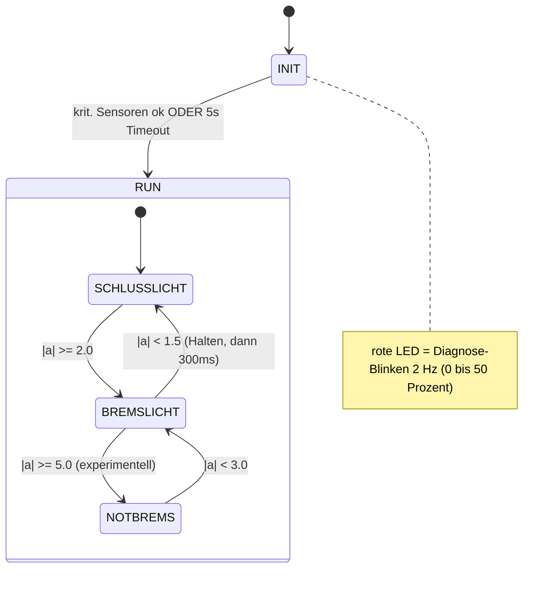
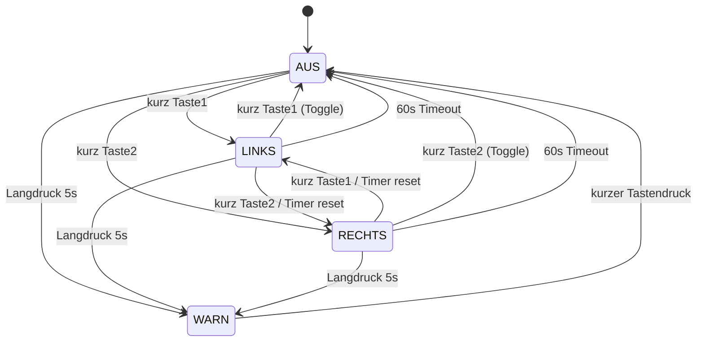

# Project Bible — Smartes Fahrrad-Rücklicht
**Bachelorarbeit Krahl · Maschinenbau & Produktentwicklung (B.Eng.)**
**Version 0.15 · Stand 05.08.2026 · Status: aktiv gepflegt (Single Source of Truth)**

> Diese Project Bible ist die oberste Wissensinstanz des Projekts. Bei Widersprüchen zwischen Chat-Historie und Project Bible gilt ausschließlich die Project Bible. Chats dienen der Diskussion und Entscheidungsfindung; der offizielle Projektstand steht ausschließlich hier.

---

## 0. Meta & Änderungsprotokoll

### 0.1 Geltungsregeln
- Die Project Bible bildet jederzeit den offiziellen Entwicklungsstand des Gesamtsystems ab.
- Widerspricht eine frühere Chat-Aussage der Project Bible, gilt die Project Bible.
- Kapitel 10 (Entwicklungsentscheidungen) wird als lebendes Änderungsprotokoll geführt.
- Trennung der Ebenen: **Project Bible** = offizieller Stand · **Kapitel 10** = Begründung der Entscheidungen · **Chats** = Diskussion.

### 0.2 Kennzeichnungslegende
- **[gesichert]** — durch mehrere Quellen bestätigt oder vom Nutzer freigegeben.
- **[Annahme]** — plausibel, aber messtechnisch/dokumentarisch noch nicht verifiziert.
- **[offen]** — in Klärung, noch nicht entschieden.

### 0.3 Änderungsprotokoll
| Version | Datum | Änderung | Anlass |
|---|---|---|---|
| 0.1 | 21.07.2026 | Erstkonsolidierung als Analysedokument. | Projektaufnahme |
| 0.2 | 21.07.2026 | 12-Kapitel-Zielstruktur. SRS-Block A. | Freigabe Block A |
| 0.3 | 21.07.2026 | SRS-Block B (Zustandsmodell). | Freigabe Block B |
| 0.4 | 21.07.2026 | SRS-Block C (Detaillogik); Norm-Grundlage § 67/ECE. | Freigabe Block C |
| 0.5 | 21.07.2026 | SRS-Block D + E (Fehler & Sicherheit). | Freigabe Block D+E |
| 0.6 | 21.07.2026 | SRS-Block F (nichtfunktional); Akku LP103454. | Freigabe Block F |
| 0.7 | 21.07.2026 | SRS-Block G + H. **SRS (Phase 1) vollständig.** | Freigabe Block G+H |
| 0.8 | 21.07.2026 | Phase 3: Monorepo + PlatformIO angelegt, Umgebung lauffähig (pioarduino, Core 3.3.11). | Setup abgeschlossen |
| 0.9 | 21.07.2026 | M1 (Rücklicht-Region R2) in Umsetzung: FSM + Host-Tests. Detailklarstellungen FR-TL-03 (Init-Blink 0↔~50 %, Zeit-Duty 50 %), FR-TL-06 (Mindesthaltezeit hält Bremslicht-Helligkeit, kein Sofortabfall), FR-TL-07 (ESS Zeit-Duty 50 %). | Implementierung M1 |
| 0.10 | 26.07.2026 | Implementierungsstand M1–M4 hardwarevalidiert, M5 Teil A (BMP280) validiert; zentrale I²C-Bus-Initialisierung; BMP280 FORCED-Mode; Modulübersicht Firmware ergänzt; Validierungsbefunde Bremsrichtung + (vorläufig) Temperatur. | Impl. M1–M5A |
| 0.11 | 29.07.2026 | App-Plattform: native iOS-App (Core Bluetooth) statt Web-App/PWA; Grund: kein Web Bluetooth auf iOS + Betreuer-Vorgabe. Firmware/BLE unverändert. | Plattform-Entscheidung App |
| 0.12 | 30.07.2026 | BLE-Brownout-Fallstudie (`docs/ble_brownout_fallstudie.md`): Bootloop bei `NimBLEDevice::init()` auf zehn Tests systematisch eingegrenzt; Root Cause = Spannungsregler des Altboards liefert RF-Kalibrierungs-Transiente nicht. Board-Wechsel auf Espressif ESP32-DevKitC-32E (WROOM-32E) beschlossen, Entkopplungskondensatoren bleiben. | Root-Cause-Analyse BLE-Brownout |
| 0.13 | 01.08.2026 | Board-Tausch auf Espressif ESP32-DevKitC-32E (WROOM-32E) **ausgeführt und am realen System validiert** (BLE-Transport M5 Teil C2: Advertising, Verbindung, MTU 185, Volllastbetrieb stabil); Board-Status in Kap. 4.1 mit Kap. 6.5/9 vereinheitlicht. iOS-App-Stand nachgezogen (Kap. 7.6/11.3: Phase 1–6 weit umgesetzt, Details App Bible). Kap. 10 um drei Entscheidungen ergänzt (Board-Tausch, Entkopplungskondensatoren behalten, WiFi verworfen). Kap. 6.5: M5 Teil B ergänzt, Host-Test-Zähler 38→75, „Nächstes" aktualisiert. | BLE-Validierung + App-Stand |
| 0.14 | 05.08.2026 | Telemetrie-Frame um `brake_light_pct` (Offset 80, tatsächlich kommandierte Rücklicht-Duty) erweitert, 80→81 Byte, Schema-Version 1→2 (FR-TEL-06). Erlaubt Vergleich Bremskennlinien-Eingang (`brake_decel_ms2`) vs. -Ausgang (`brake_light_pct`) für die FR-TL-06-Validierung. Firmware host-getestet (77/77), ESP32-Build grün. Alle „80-Byte-Frame"-Nennungen auf „81-Byte-Frame" nachgezogen (Kap. 7.2/7.6). | Frame-Erweiterung `brake_light_pct` |
| 0.15 | 05.08.2026 | Serial-Bench-Validierung der Bremslicht-Logik (Firmware `d8a4e75`, `docs/Validierung/`): Bremskennlinie (FR-TL-06), Zeitverhalten (NFR-RT-01, 300-ms-Haltezeit) und Fail-Safe (FR-SAF-01/FR-STA-04) am realen MCU nachgewiesen (Kap. 9, neu 9.3). iOS-App am realen iPhone gegen die echte BLE-Verbindung verifiziert (Kap. 9, 11.3). Kap. 10 + `decision_log.md` um die Bench-Methodik-Entscheidung ergänzt (freigegeben). `roadmap.md` M7 nachgezogen. | Serial-Bench-Validierung Bremslicht + iOS-BLE verifiziert |

### 0.4 Datengrundlage
| Quelle | Zeitstempel | Aussagekraft |
|---|---|---|
| Projektübergabe-Dokument | „Stand Juni 2026" | Detaillierteste Einzelquelle |
| `blinker_brake_rf_test.ino` | 22.06.2026 | Firmware-Stand (Arduino-IDE-Ära) |
| `gyrobaro.ino` (sensor_validierung_v3) | 25.05.2026 | Komplementärfilter |
| Schaltplan v2.pdf | 20.05.2026 | Gesamtübersicht, fehlerbehaftet (Kap. 11) |
| `Uebersicht.xlsx` (BOM) | 17.02.2026 | Stückliste mit Preisen |
| Datenblätter (ESP32, BMP280, GY-521, IRLZ44N, MT3608, TP4056, L86) | Herstellerstand | Referenzwerte |
| ESP32-DevKitC Getting Started Guide (Espressif) | Herstellerstand | Board/Pinbelegung/Maße Ersatzboard (s. Kap. 4, 10) |
| ESP32-WROOM-32E Datasheet v2.0 (Espressif) | v2.0 | Modul/BLE/elektr. Daten Ersatzboard (s. Kap. 4, 10) |
| Nutzer-Lastenheft Firmware | 21.07.2026 | Funktionaler Zielumfang (Kap. 2) |
| § 67 StVZO / ECE R6 / ECE R50 (recherchiert) | 07/2026 | Normative Grundlage (Kap. 2.8) |
| Repo `smart-bike-rearlight` (Monorepo, PlatformIO) | ab 21.07.2026 | Implementierungsstand (Phase 3) |

---

## 1. Projektübersicht

### 1.1 Ziel
Entwicklung eines funktionsfähigen Prototyps eines *Smart Bike Rear Light*. Das System fungiert als IoT-Gerät, das mittels IMU-gesteuerter Bremslichtfunktion, Funk-Blinkern (433 MHz) und einer Live-Datenschnittstelle (BLE → iOS-App) die Verkehrssicherheit und Datenaufzeichnung für Radfahrer verbessert.

### 1.2 Kurzbeschreibung
Ein ESP32 erfasst zyklisch Daten von GNSS (Quectel L86), Barometer (BMP280) und IMU (MPU-6050), steuert ein rotes Schluss-/Bremslicht (PWM) sowie gelbe Funk-Blinker und streamt Live-Telemetrie an eine native iOS-App, die Statistik, Sensorfusion und Visualisierung übernimmt.

### 1.3 MVP
Zuverlässige Sensorerfassung und -Streaming, funktionierendes Schluss-/Bremslicht (intensitätsabhängig), Funk-Blinker, BLE-Live-Anzeige der Basis-Kennzahlen. Details s. Kap. 2.4.

### 1.4 Future Work
Erweiterte Fahranalyse, Sensorfusion, Sicherheitsfunktionen, Pseudo-Leistung/Kalorien, automatische Blinker-Rückstellung, RF-Anlernmodus, GNSS-Warnanzeige, OTA-Updates. Details s. Kap. 2.4.

---

## 2. Anforderungen an die Firmware (SRS) — vollständig (Blöcke A–H)

### 2.0 Kennzeichnung & ID-Systematik
Anforderungs-IDs: `FR-<Subsystem>-NN` (funktional), `NFR-<Kategorie>-NN`, `CON-NN` (Randbedingung), `OUT-NN` (ausgeschlossen).
Subsystem-Kürzel: `SYS`, `TL`, `BLK`, `RF`, `SNS`, `TEL`, `STA`, `SAF` (Sicherheit), `CFG` (Konfiguration).
NFR-Kategorien: `RT` (Echtzeit), `RES` (Ressourcen), `PWR` (Energie), `TST` (Testbarkeit), `EXT` (Erweiterbarkeit).

> **Bearbeitungsstand SRS:** **Alle Blöcke A–H freigegeben — SRS vollständig (21.07.2026).** A (2.1), B (2.6), C (2.7), D (2.6/2.7), E (2.9), F (2.10), G (2.11), H (2.12). Normative Grundlage in 2.8.

### 2.1 Systemgrenzen & Kontext — Block A

| ID | Anforderung | Status |
|---|---|---|
| FR-SYS-01 | Firmware = Datenerfassungs- und Echtzeitknoten. Alle kumulativen/fusionierten Kennzahlen werden in der App berechnet (Variante 2). App-seitig aktuell als native iOS-App realisiert (s. Kap. 7); die Anforderung selbst bleibt client-agnostisch. | gesichert |
| FR-SYS-02 | Firmware liest GNSS, BMP280, MPU6050 zyklisch aus und stellt Rohmesswerte als Telemetrie bereit. | gesichert |
| FR-SYS-03 | Lokal nur echtzeit-/sicherheitsrelevante Größen: Bremslichtintensität aus IMU-Verzögerung, Blinkerzustand. | gesichert |
| FR-SYS-04 | Schnittstelle zur App unidirektional (ESP32 → App); keine Steuerbefehle über BLE. | gesichert |
| FR-SYS-05 | Blinkersteuerung ausschließlich über 433-MHz-Fernbedienung. | gesichert |
| FR-TL-01 | Rote LED = kombiniertes Schluss-/Bremslicht; Grundzustand dauerhaft gedimmtes Schlusslicht. | gesichert |
| FR-TL-02 | Bremslicht-Helligkeit steigt mit der Bremsintensität (Kennlinie FR-TL-06). | gesichert |
| CON-01 | Datsenke = App (aktuell native iOS-App, s. Kap. 7); Firmware speichert nicht dauerhaft, nur flüchtiger RAM-Ringpuffer (FR-TEL-04). | gesichert |
| OUT-01 | Keine Akkustandsanzeige/Batteriespannungsmessung in HW/FW. | gesichert |
| OUT-02 | Nicht im MVP: Auto-Helligkeit, Standlicht, Auto-Blinker-Rückstellung, Flash-Voll-Logging. | gesichert |

### 2.2 Datenkatalog — Rohmesswerte (Firmware liefert)
- **GNSS (L86):** Position, Geschwindigkeit, Heading, UTC-Zeit, Satellitenanzahl, HDOP, Höhe.
- **BMP280:** Luftdruck, Temperatur.
- **MPU-6050:** Beschleunigung (3 Achsen), Drehrate (3 Achsen).

### 2.3 Datenkatalog — abgeleitete Fahrdaten (App berechnet, FR-SYS-01)
- **aus GNSS:** aktuelle/Durchschnitts-/Höchstgeschwindigkeit, Distanz, Route, Fahrzeit, Bewegungsrichtung, Start-/Zielposition, Zwischenzeiten.
- **aus BMP280:** aktuelle Höhe, Höhenmeter bergauf/bergab, max./min. Höhe, Temperatur, durchschnittl. Steigung.
- **aus MPU:** Bremsvorgänge, Sprints, Kurvenwinkel/-anzahl, Lean Angle, Sturzerkennung, Schräglagen L/R.
- **Sensorfusion:** GNSS+MPU, GNSS+BMP, BMP+MPU, alle drei (Pseudo-Power → Kalorien, Trainingsintensität).

### 2.4 MVP- und Future-Work-Umfang (App-Anzeige)
**MVP:** aktuelle/Durchschnitts-/Maximalgeschwindigkeit, Distanz, Fahrzeit, Höhe, Höhenmeter, Satellitenanzahl, Bluetooth-Status. *(kein Akkustand, OUT-01.)*
**Future-Work:** erweiterte Fahranalyse, Sicherheitsfunktionen (Bremslicht-/Sturzerkennung, GNSS-Verlust-Warnanzeige), Nice-to-have (Pseudo-Leistung, Kalorien, Höhenprofil, Bremsereignisse, Schlagloch-/Road-Quality, Fahrstilanalyse, Effizienzindex), RF-Anlernmodus, OTA.

### 2.5 Eingangs-Lastenheft
Vollständig in den SRS-Blöcken A–H formalisiert. Keine offenen Rohanforderungen mehr.

### 2.6 Zustandsmodell — Block B (+ D-Präzisierungen)
Vier parallele (orthogonale) Regionen (Statechart nach Harel; Diagramme in Kap. 6.6). Kritischer Sensor ist ausschließlich die IMU (MPU6050); GNSS und BMP280 optional.

| ID | Anforderung | Status |
|---|---|---|
| FR-STA-01 | Power-On → INIT. Übergang INIT→RUN, sobald kritische Sensoren (IMU) initialisiert sind oder Init-Timeout 5 s abgelaufen ist. | gesichert |
| FR-STA-02 | Bei Init-Timeout → degradierter RUN: rote LED dauerhaft Schlusslicht (§ 67 gewahrt), fehlende Sensoren als Fehler geführt. | gesichert |
| FR-STA-03 | Regionen 2–4 laufen unabhängig; Sensor-/Systemfehler erzwingt kein regionsübergreifendes Sperren. | gesichert |
| FR-TL-03 | Während INIT signalisiert die rote LED per Diagnose-Blinken (~2 Hz, Zeit-Duty 50 %, moduliert zwischen 0 % und ~50 % Helligkeit — bewusst gedämpft, distinkt vom vollhellen Bremslicht; C3.1) die Nicht-Bereitschaft. Transienter Zustand vor Betriebsbeginn. | gesichert |
| FR-TL-04 | In RUN leuchtet die rote LED dauerhaft mindestens als gedimmtes Schlusslicht (~20 %). | gesichert |
| FR-TL-05 | Bremslicht ist temporäre Helligkeitsanhebung; nach Bremsende Rückfall auf Schlusslicht (Kennlinie FR-TL-06). | gesichert |
| FR-BLK-01 | Richtungsblinker per kurzem Tastendruck (T1=links, T2=rechts); erneuter kurzer Druck = aus (Toggle). | gesichert |
| FR-BLK-02 | Umschalten Links↔Rechts durch andere Taste; setzt 60-s-Timeout neu. | gesichert |
| FR-BLK-03 | Richtungsblinker: max. Blinkdauer 60 s → automatische Selbstabschaltung. Keine Reaktivierungssperre. | gesichert |
| FR-BLK-04 | Warnblinker durch Langdruck (≥ 5 s) einer beliebigen Taste; beide Seiten blinken; kein Timeout. | gesichert |
| FR-BLK-05 | Warnblinker endet durch beliebigen einzelnen kurzen Tastendruck → AUS. Druck wird verbraucht, startet keinen Richtungsblinker. | gesichert |
| FR-BLK-06 | Links/Rechts als Richtung gegenseitig verriegelt; WARN einziger Zustand mit beidseitigem Blinken. | gesichert |
| FR-BLK-07 | Kurz-/Langdruck-Diskriminierung: Loslassen < 5 s = Kurzdruck; Halten ≥ 5 s = Warnblinker. | gesichert |
| FR-BLK-09 | RF-Blinkerbefehle werden erst ab RUN wirksam; während INIT verworfen. | gesichert |
| FR-SNS-01 | Ab RUN werden GNSS, BMP280, MPU6050 zyklisch gesampelt — unabhängig vom BLE-Zustand. | gesichert |
| FR-TEL-01 | Bei BLE-Verbindung Telemetrie-Stream; ohne Verbindung RAM-Ringpuffer (FR-TEL-04). | gesichert |

### 2.7 Funktionale Detaillogik — Block C

| ID | Anforderung | Status |
|---|---|---|
| FR-TL-06 | Bremslicht-Kennlinie: Schlusslicht-Grundhelligkeit ~20 % PWM. Stetig-linearer Anstieg von 2,0 m/s² bis Sättigung 5,0 m/s² (100 %). Ausschalthysterese: Rückfall unter ~1,5 m/s². **Mindesthaltezeit 300 ms: während der Haltezeit wird die Bremslicht-Helligkeit gehalten (kein Sofortabfall auf Schlusslicht); erst danach Rückfall (kurzer Fade).** Anstieg schnell (Sicherheit). Eingang: gravitationskompensierte Verzögerung (Y-Achse, α=0,98). Norm-Anker ECE R50 (§ 67 Abs. 4). Schwellwerte feldzukalibrieren [Annahme]. | gesichert |
| FR-TL-07 | Notbrems-Blinken (ESS-Konzept), Zustand des roten Kanals: aktiviert ab ≥ 5,0 m/s², deaktiviert bei < 3,0 m/s² (Hysterese). ~4 Hz, Zeit-Duty 50 %, Helligkeits-Modulation 100 % ↔ Schlusslicht-Grundniveau (nie 0 %). **Experimentalfunktion, standardmäßig DEAKTIVIERT — nicht konform mit § 67 Abs. 4 StVZO.** | gesichert (experimentell) |
| FR-BLK-08 | Blinkfrequenz 1,5 Hz (ECE R6: 1,5 Hz ± 0,5), Duty 50 %, Hellzeit > 0,3 s. | gesichert |
| CON-02 | PWM-Trägerfrequenz aller LED-Kanäle 5 kHz. | gesichert |
| FR-RF-01 | Kontinuierliche Überwachung GPIO4 (RCSwitch); nur bekannte Codes (T1=10967538, T2=10967537), sonst ignoriert. | gesichert |
| FR-RF-02 | Druck erst nach ≥ 2 identischen Empfängen gültig (Entprellung/EMV). | gesichert |
| FR-RF-03 | Halte-Erkennung; „losgelassen" nach Empfangslücke > Release-Timeout (~150 ms, final nach Verifikationstest). | gesichert |
| FR-RF-04 | Kurzdruck (< 5 s) → SHORT; Halten ≥ 5 s → LONG (Warnblinker). | gesichert |
| FR-RF-05 | Reaktionszeit erkanntes Ereignis → LED < 100 ms. | gesichert |
| FR-RF-06 | RF-Codes fest im Code; Anlern-/Pairing-Modus → Future-Work. | gesichert |
| FR-SNS-02 | Sampling: IMU 100 Hz, BMP280 10 Hz, GNSS 1 Hz (ab RUN, unabhängig von BLE). | gesichert |
| FR-TEL-02 | Telemetrie-Frame 10 Hz, frischeste Werte + Status. | gesichert |
| FR-TEL-03 | Frame-Inhalt: IMU (6 Achsen + Verzögerung), BMP (Druck, Temp), GNSS (Breite, Länge, Speed, Heading, Höhe, Sats, HDOP, UTC), Status. Kein Akkustand. | gesichert |
| FR-TEL-04 | Ohne BLE Pufferung im RAM-Ringpuffer; Überlauf überschreibt Ältestes (Dimensionierung NFR-RES-01). | gesichert |

### 2.8 Normative Grundlagen der Lichtfunktionen [recherchiert 07/2026]

| Norm | Gegenstand | Bezug im Projekt |
|---|---|---|
| § 67 Abs. 3 StVZO | Scheinwerfer: Blinken unzulässig | – |
| § 67 Abs. 4 StVZO | Rote Schlussleuchte (kein Blinken); Bremslichtfunktion zulässig (ECE R50) | FR-TL-01/04/06 konform; **FR-TL-07 Konflikt** |
| § 67 Abs. 5 StVZO | Fahrtrichtungsanzeiger zulässig (ECE R50/R148, Anbau R74), gelb/amber | FR-BLK-* |
| ECE R6 | Blinkfrequenz 1,5 Hz ± 0,5, Hellzeit > 0,3 s | FR-BLK-08 |
| ECE R50 | Schluss-/Bremslichtfunktion | FR-TL-06 |
| ECE R48 (nur Kfz) | Emergency Stop Signal — für Fahrräder nicht anwendbar | FR-TL-07 (Konzeptanker) |

Hinweis: Sekundärquellen; für die Thesis am Primärtext (§ 67) gegenprüfen. Keine Rechtsberatung.

### 2.9 Fehlerbehandlung & Sicherheit — Block E

| ID | Anforderung | Status |
|---|---|---|
| FR-SAF-01 | Fail-safe-Leitprinzip: Bei jedem erkennbaren Fehler bleibt das rote Schlusslicht an (§ 67, höchste Priorität). Ausnahmen: Watchdog-Reset, experimentelles Notbrems-Blinken. | gesichert |
| FR-SAF-02 | Funktionspriorität: Schlusslicht > Bremslicht > Blinker > Telemetrie. | gesichert |
| FR-SAF-03 | Task-Watchdog (~2 s), Reset bei Hang; Reset-Ursache als Diagnose-Flag. | gesichert |
| FR-SAF-04 | BLE-/Telemetrie-Fehler dürfen Licht/Blinker nicht beeinträchtigen. | gesichert |
| FR-STA-04 | Laufzeit-IMU-Ausfall → sicheres Schlusslicht, Fehler-Flag, Hintergrund-Reinit. | gesichert |
| FR-STA-05 | Ausfall optionaler Sensoren → Weiterbetrieb, Telemetriefelder ungültig markiert. | gesichert |
| FR-STA-06 | Kein harter FAULT im MVP; degradierter RUN mit Fehler-Flags. `S_FAULT` reserviert. | gesichert |
| FR-SNS-03 | I²C-Zugriffe zeitbegrenzt (~25–50 ms), nicht-blockierend. | gesichert |
| FR-SNS-04 | Gestufte, nicht-blockierende I²C-Recovery (Re-Init → SCL-Clock → nach ~3 Versuchen als ausgefallen markieren). | gesichert |
| FR-SNS-05 | Leichte Plausibilitätsprüfung (Wertebereich + Eingefroren-Erkennung). | gesichert |
| FR-TEL-05 | GNSS-Status NO_DATA/NO_FIX/FIX_OK; Fix gültig wenn isValid & Alter < 3 s & Sats ≥ 4. | gesichert |

### 2.10 Nichtfunktionale Anforderungen — Block F

| ID | Anforderung | Status |
|---|---|---|
| NFR-RT-01 | Bremslicht-Reaktionszeit ≤ 50 ms (Ereignis → LED); messtechnisch zu verifizieren. | gesichert |
| NFR-RT-02 | Blinktakt 1,5 Hz timer-basiert; Periodentoleranz ± 5 %. | gesichert |
| NFR-RT-03 | Kooperativer, nicht-blockierender Scheduler (`millis()`-Tasks, feste Reihenfolge); IMU/Bremslicht 100 Hz. Keine eigenen FreeRTOS-Application-Tasks im MVP. | gesichert |
| NFR-RT-04 | Worst-Case-Loop-Durchlauf < 10 ms. | gesichert |
| NFR-RES-01 | RAM-Ringpuffer ~60 s @ 10 Hz (≈ 600 Frames), statisch vorreserviert. | gesichert |
| NFR-RES-02 | Keine dynamische Speicherallokation im Betrieb (Heap-Fragmentierung vermeiden). | gesichert |
| NFR-RES-03 | RAM-/CPU-Auslastung gemessen und dokumentiert. | gesichert |
| CON-03 | Flash-Partition „No OTA / große App"; OTA → Future-Work. Konfig über NVS/`Preferences`; kein Dateisystem im MVP. | gesichert |
| NFR-PWR-01 | WiFi aus (nur BLE); kein Deep/Light-Sleep im MVP; optional `yield`/`delay(1)`. | gesichert |
| NFR-PWR-02 | Zielaufzeit ~13 h (Schätzung), messtechnisch zu verifizieren; Messplan definierter Lastfälle inkl. MT3608-η. Keine harte Mindestlaufzeit gefordert. | gesichert |

### 2.11 Konfigurierbarkeit — Block G

| ID | Anforderung | Status |
|---|---|---|
| FR-CFG-01 | **Parametrierbar (NVS):** Bremsschwellen (2,0/5,0/3,0/1,5 m/s²), Mindesthaltezeit, GNSS-Fix-Kriterien, Aktivierungs-Flag FR-TL-07. **Fest im Code:** Pinbelegung, PWM-Frequenz (5 kHz), Blinkfrequenz (1,5 Hz), Timeouts (60 s, 5 s), RF-Codes, Sampling-/Telemetrie-Raten. | gesichert |
| FR-CFG-02 | Serielles Kalibrier-/Konfigurations-Interface über UART0 (get/set/list/reset), nicht-blockierend; Werte in NVS. Entwickler-/Kalibrierwerkzeug. | gesichert |
| FR-CFG-03 | Bei leerem/fehlendem NVS Compile-Zeit-Defaults; `config_version`-Schlüssel für Schema-Migration/Reset nach Firmware-Update. | gesichert |

### 2.12 Testbarkeit & Erweiterbarkeit — Block H

| ID | Anforderung | Status |
|---|---|---|
| NFR-TST-01 | Strikte Trennung reine Logik ↔ Hardware-Treiber; Logik host-seitig ohne ESP32 testbar. | gesichert |
| NFR-TST-02 | Testdaten-Einspeisung (aufgezeichnete/synthetische Sensordaten) als schlanker Hook; tiefere Simulation → Future-Work. | gesichert |
| NFR-TST-03 | Zwei Test-Ebenen: (a) Host-Unit-Tests der Logik (Unity/PlatformIO `native`, CI); (b) On-Target-Validierung (Kap. 9). | gesichert |
| NFR-EXT-01 | Modulare Struktur mit klaren Schnittstellen; neue Sensoren/Telemetriefelder ergänzbar ohne Bruch. | gesichert |
| FR-TEL-06 | Telemetrie-Frame trägt eine Schema-/Versionskennung (unabhängige Firmware-/App-Entwicklung). | gesichert |

---

## 3. Gesamtsystem

### 3.1 Architektur (Variante 2 — verteilte Berechnung)
```
[Sensorik]                [ESP32 Firmware]                 [iOS-App]
 GNSS L86  ─UART2─┐        ┌───────────────────────┐       ┌────────────────────┐
 BMP280    ─I²C──┼──────▶ │ Erfassung + Echtzeit-  │──BLE─▶│ Statistik, Fusion, │
 MPU6050   ─I²C──┘        │ logik (Bremse/Blinker) │ (uni) │ Speicherung, UI    │
 433-MHz-RX ─GPIO4──────▶ │ + Telemetrie-Stream    │       └────────────────────┘
                          └─────────┬──────────────┘
                                    │ PWM (GPIO25/26/27)
                            [Aktorik: rote + gelbe LEDs über IRLZ44N]
```

### 3.2 Datenflüsse
Sensor-Rohdaten → Firmware (Sampling FR-SNS-02) → (a) echtzeitkritische Ableitung Bremse/Blinker → LED; (b) Telemetrie-Serialisierung (10 Hz, versioniert) → BLE-Notify → App. Steuerrichtung App→ESP32 existiert nicht (FR-SYS-04).

### 3.3 Schnittstellen
I²C (Sensoren), UART2 (GNSS), UART0 (Debug/Konfig), digitaler GPIO-Eingang (RF), PWM-Ausgänge (LEDs, 5 kHz), BLE (Telemetrie → App).

---

## 4. Hardware

### 4.1 Bauteilübersicht
| Ref. | Bauteil | Hersteller/Typ | Funktion | Schnittstelle | Status |
|---|---|---|---|---|---|
| U3 | ESP32 NodeMCU DevKit C V2 → **Espressif ESP32-DevKitC-32E (WROOM-32E)** (getauscht) | AZ-Delivery → Espressif | Hauptrechner | 3,3 V GPIO | **Board-Tausch ausgeführt und validiert** (Root Cause BLE-Brownout: Regler des Altboards liefert RF-Kalibrierungs-Transiente nicht, s. `docs/ble_brownout_fallstudie.md`); pin-kompatibel (38-Pin-DevKitC-Layout), ohne Neuverkabelung getauscht; BLE unter Volllast stabil, kein Brownout (Kap. 6.5/9) |
| IC2 | MPU-6050 (GY-521) | AZ-Delivery | IMU | I²C 0x68 | validiert |
| IC3 | BMP280 | AZ-Delivery | Barometer | I²C 0x76 | validiert |
| IC4 | Quectel L86 | Quectel | GNSS | UART2, 9600 Bd | teilvalidiert (Fix offen) |
| U4 | SRX882S V2.0 | – | 433-MHz-Empfänger | Digital, GPIO4 | validiert |
| – | QIACHIP-Fernbedienung (2 Tasten) | QIACHIP | Blinkerauslösung | 433 MHz ASK | validiert (10967538 / 10967537) |
| Q1–Q3 | IRLZ44N (3×) | Int. Rectifier | LED-PWM-Treiber | Gate an GPIO | GPIO-Pegel validiert, LED-Last offen |
| U1 | TP4056 Typ-C | – | LiPo-Laderegler 1 A (DW01) | USB-C | unter Last unverifiziert |
| U2 | MT3608 Step-Up | AZ-Delivery | 3,7→5 V (η ≤ 97 %) | Trimmer 5,00 V | unter Last nicht abgeglichen |
| BT1 | LiPo-Akku **LP103454**, 3,7 V, 2000 mAh | LP103454 (10,3 × 34 × 54 mm) | Energiespeicher | 3,7–4,2 V | verbaut, Kapazität gesichert |
| SW1 | Rastender Drucktaster IP65, 8 mm | – | Ein/Aus | – | verbaut; fehlt in Schaltplan/BOM |
| D1 | Rote LED | Vrabocry | Schluss- + Bremslicht (GPIO26) | PWM über Q2 | Kanalzuordnung/Datenblatt offen |
| D2/D3 | Gelbe LEDs | Vrabocry | Blinker L/R | PWM über Q1/Q3 | s. Kap. 11 |
| ANT1/ANT2 | GNSS-/433-MHz-Antenne | Namvo / Draht 17,3 cm | Empfang | – | dokumentiert |

**D1 (rote LED):** kombiniertes Schluss- und Bremslicht auf einem PWM-Kanal (GPIO26); Notbrems-Blinken ist ein Zustand *dieses* Kanals.

### 4.2 Pinbelegung [gesichert]
| Signal | GPIO | Zielgerät | Bewertung |
|---|---|---|---|
| SDA | GPIO21 | BMP280 + MPU6050 | gesichert |
| SCL | GPIO22 | BMP280 + MPU6050 | gesichert |
| UART2 RX | GPIO16 | L86 TXD1 | gesichert |
| UART2 TX | GPIO17 | L86 RXD1 | gesichert |
| RF DATA | GPIO4 | SRX882S | gesichert (Schaltplan GPIO34 veraltet) |
| Blinker links | GPIO25 | Q1 Gate | gesichert (Schaltplan fehlerhaft) |
| Bremslicht (PWM) | GPIO26 | Q2 Gate | gesichert (Schaltplan fehlerhaft) |
| Blinker rechts | GPIO27 | Q3 Gate | gesichert |
| Gate-Widerstand | 100 Ω | alle 3 Gates | gesichert |
| Gate-Pull-Down | 10 kΩ → GND | alle 3 Gates | real verbaut; fehlt in Schaltplan/BOM |

Hinweis: GPIO4 durch RF belegt → MPU6050-INT-Pin ungenutzt (Polling statt Interrupt). Pinbelegung im Code: `firmware/include/pins.h`. Der Board-Tausch (Kap. 4.1) ist pin-kompatibel; die Belegung bleibt unverändert.

**I²C-Bus-Initialisierung [gesichert]:** `Wire.begin(SDA,SCL)` + `Wire.setTimeOut(I2C_TIMEOUT_MS)` erfolgen zentral einmalig in `main.cpp`/`setup()` (Anwendungsebene), nicht in den einzelnen Sensor-Treibern. `imu_driver` und `bmp280_driver` sind reine Bus-Nutzer. Grund: Modularität und Unabhängigkeit optionaler Sensoren — kein Treiber muss wissen, ob/welcher andere Treiber den Bus bereits initialisiert hat (s. Kap. 10). BMP280-Adresse `0x76` als Konstante `BMP280_I2C_ADDR` in `config.h` (analog `MPU6050_I2C_ADDR = 0x68`).

---

## 5. Elektronik & Stromversorgung

### 5.1 Topologie
```
USB-C 5V → TP4056 (1A Ladung) → LiPo LP103454, 3,7–4,2V, 2000 mAh
                                   ↓ (über OUT+, NICHT B+)
                            MT3608 Step-Up (Trimmer auf 5,00V)
                                   ↓ (über Einschalter SW1)
                            ESP32 Vin → onboard AMS1117-3.3 → 3,3V Sensorik
```

**Entkopplungs-/Pufferkondensatoren [gesichert, verbaut]:** Je ein 1000-µF-Elektrolyt-
kondensator an Vin/5V↔GND (Reglereingang) und an 3V3↔GND (Reglerausgang, direkt an den
Modul-Pins, Zuleitungswiderstand < 1 Ω). Ursprünglich als Gegenmaßnahme zum BLE-Brownout-
Bootloop verlötet, dort ohne Wirkung (Root Cause liegt am Regler des Altboards selbst, durch
Board-Tausch behoben, s. `docs/ble_brownout_fallstudie.md`); bleiben als Bestandteil eines
robusten Stromversorgungsdesigns verbaut (verbesserte Transienten-/EMV-Robustheit bei
Lastspitzen, z. B. LED-Schaltvorgänge).

### 5.2 Energiebilanz [Annahme — keine Messwerte]
Akku: LiPo **LP103454**, 3,7 V nominal, **2000 mAh** (gesichert).

| Verbraucher | Strom (angenommen) |
|---|---|
| ESP32 aktiv (WiFi aus) | ~80 mA |
| MPU6050 | ~3,5 mA |
| BMP280 | ~0,5 mA |
| SRX882S | ~3,5 mA |
| GPS L86 (Tracking) | ~26 mA |
| LED Rücklicht | ~50 mA |
| **Summe** | **~163 mA** |
| Rechnerische Laufzeit @ 2000 mAh | **~13 h** |

Berücksichtigt weder MT3608-Wirkungsgrad noch Ruheströme noch Lastspitzen. Messtechnische Verifikation erforderlich (Messplan NFR-PWR-02).

### 5.3 Hinweis zur Zustandsüberwachung
Keine Batteriespannungsmessung (OUT-01). Ladezustand nur über USB-C-/TP4056-Modul. Konsequenz: keine Low-Battery-Warnung durch die Firmware.

---

## 6. Firmware

### 6.1 Entwicklungsumgebung
**Aktuell (Phase 3, ab 21.07.2026):** VS Code + **PlatformIO** + **Claude Code**. Plattform **pioarduino** (`platform-espressif32`, Release *stable*) → Arduino-ESP32-Core **3.3.11** (ESP-IDF 5.5.x). Board `esp32dev`, Partition `huge_app.csv` (No-OTA, CON-03), Upload 115200/921600 Baud, Monitor 115200. Host-Unit-Tests im `native`-Env (NFR-TST-03). Konfiguration über `Preferences` (NVS). Erster Build erfolgreich: Flash 10,3 %, RAM 7,3 % (großer Puffer, NFR-RES).

**Begründung pioarduino:** Die offizielle PlatformIO-Plattform `espressif32` liefert nur Arduino-Core 2.0.17 (kein `ledcAttach`). Die Community-Plattform pioarduino stellt Core 3.x bereit — Voraussetzung für die SRS-Konvention CON-02/`ledcAttach` (s. Kap. 10).

**Build-Voraussetzung (macOS):** `liblzma` muss vorhanden sein (`brew install xz`), sonst scheitert die Toolchain-Installation der pioarduino-Plattform am Python-`lzma`-Modul. (Lessons Learned im Repo.)

**Vorher (bis Phase 2, überholt):** Arduino IDE (macOS), esp32-Core v3.x, „ESP32 Dev Module", CP2102.

### 6.2 Bibliotheken
Adafruit MPU6050, Adafruit BMP280, Adafruit Unified Sensor, TinyGPSPlus (Mikal Hart), RCSwitch (sui77), NimBLE-Arduino (BLE-Telemetrie, M5 Teil C2). Versionen in `firmware/platformio.ini`.

### 6.3 Konventionen
PWM ausschließlich über `ledcAttach()`/`ledcWrite()` (Core v3.x). Kooperativer nicht-blockierender Scheduler, kein `delay()` im Betrieb, statische Speicherverwaltung, Trennung Logik ↔ Hardware, ID-Referenzen in Kommentaren. Details: `CLAUDE.md` im Repo.

### 6.4 Repository (Monorepo)
`firmware/` (PlatformIO), `webapp/` (ursprünglich für eine PWA vorgesehen — seit v0.11 durch die native iOS-App abgelöst, s. Kap. 7/10; Ordner bleibt bestehen, endgültiger Ablageort des iOS-App-Codes noch offen), `docs/` (Bible-Kopie + Wissensdatenbank + `ble_brownout_fallstudie.md`), `hardware/`, `cad/`, `testdata/`. Logik hardwarefrei in `firmware/lib/logic`, Treiber in `firmware/lib/drivers`. Wissensdatenbank: `decision_log.md`, `current_context.md`, `roadmap.md`, `open_issues.md`, `lessons_learned.md`, `ble_brownout_fallstudie.md`.

### 6.4a Modulübersicht Firmware
Ordnerprinzip: `lib/logic` = hardwarefreie, host-testbare Logik (kein `Arduino.h`); `lib/drivers` = Hardwarezugriff (I²C/PWM/RF); `src` = kooperativer Scheduler; `include` = Header/Konstanten.

| Ordner | Modul | Inhalt |
|---|---|---|
| `include/` | `pins.h` | GPIO-Zuordnung |
| `include/` | `config.h` | alle Konstanten |
| `src/` | `main.cpp` | kooperativer Scheduler, Tasks |
| `lib/logic/` | `brake_curve` (.h+.cpp) | Bremskennlinie FR-TL-06 |
| `lib/logic/` | `tail_light_fsm` (.h+.cpp) | Zustandsautomat Rücklicht/Bremslicht (R2) |
| `lib/logic/` | `lifecycle_fsm` (.h+.cpp) | Lebenszyklus Init→Run, degraded (R1) |
| `lib/logic/` | `motion_filter` (.h+.cpp) | Komplementärfilter + Schwerkraftkompensation → Verzögerung |
| `lib/logic/` | `button_decoder` (.h+.cpp) | RF-Signale → Tastenereignisse (kurz/lang, entprellt) |
| `lib/logic/` | `blinker_fsm` (.h+.cpp) | Zustandsautomat Blinker L/R/Warn (R3) |
| `lib/logic/` | `system_state.h` | nur Header: Typ `SystemState{Init,Run}` |
| `lib/drivers/` | `led_output` (.h+.cpp) | PWM-Ansteuerung LEDs |
| `lib/drivers/` | `imu_driver` (.h+.cpp) | MPU6050 über I²C |
| `lib/drivers/` | `rf_input` (.h+.cpp) | 433-MHz-Empfänger |
| `lib/drivers/` | `bmp280_driver` (.h+.cpp) | BMP280 Barometer über I²C (M5) |
| `lib/drivers/` | `gnss_driver` + `gnss_fix` | L86/GNSS über UART2, Fix-Status (M5 Teil B) |
| `lib/logic/` | `imu_health` | Plausibilität/Recovery/Fail-Safe (Härtung, FR-SNS-04/05, FR-STA-04) |
| `lib/drivers/` | `ble_telemetry` | BLE-Notify-Transport, NimBLE (M5 Teil C2) |
| `test/` (native, Unity) | u. a. `test_brake_curve`, `test_tail_light_fsm`, `test_lifecycle_fsm`, `test_motion_filter`, `test_button_decoder`, `test_blinker_fsm`, GNSS-/Telemetrie-Tests | 75/75 grün |

**Architekturhinweis — zentrale I²C-Bus-Initialisierung:** `Wire.begin(PIN_I2C_SDA, PIN_I2C_SCL)` + `Wire.setTimeOut(I2C_TIMEOUT_MS)` laufen einmalig in `main.cpp`/`setup()`; `imu_driver` und `bmp280_driver` rufen selbst kein `Wire.begin()` mehr auf (reine Busnutzer, FR-SNS-03 an einer Stelle). IMU-Regressionstest nach dem Umbau bestanden (`degraded=0`, Bremslicht reagiert weiterhin korrekt).

### 6.5 Implementierungsstand
- **M0 Grundgerüst** ✅
- **M1 Rücklicht/Bremslicht R2** (`tail_light_fsm`, `brake_curve`, `led_output`) ✅ HW-validiert; Mindesthaltezeit hält die Bremslicht-Helligkeit (FR-TL-06).
- **M2 Lebenszyklus R1** (`lifecycle_fsm`, `system_state`) ✅ HW-validiert (RUN, `degraded=0`).
- **M3 Sensorik/Bremserkennung** (`imu_driver`, `motion_filter`) ✅ HW-validiert; Fahrtrichtung feldkalibriert (nur Verzögerung in Fahrtrichtung löst aus, Vorzeichen `MOTION_BRAKE_SIGN`).
- **M4 Blinker + RF** (`rf_input`, `button_decoder`, `blinker_fsm`) ✅ Funktion HW-validiert (physische L/R-Zuordnung offen, s. Kap. 11).
- **M5 Teil A Barometer** (`bmp280_driver`, FORCED-Mode) ✅ validiert; zentrale I²C-Bus-Init.
- **M5 Teil B GNSS** (`gnss_driver`, `gnss_fix`, Fix-Status FR-TEL-05) ✅ UART/Parsing am Board validiert (Indoor korrekt `NO_FIX`; echter Fix braucht Freilandtest, s. Kap. 11).
- **Härtung** (I²C-Recovery + Plausibilität + Fail-Safe `imu_health`, FR-SNS-04/05/FR-STA-04; Task-Watchdog + Reset-Reason-Diagnose FR-SAF-03) ✅ am Board per Fehlerinjektion (SDA-Kurzschluss) bzw. Hang-Hook verifiziert.
- **M5 Teil C2 BLE-Telemetrie** (`ble_telemetry`, NimBLE-Arduino) ✅ implementiert, host-getestet (75/75) und **am realen System validiert**: Board-Tausch auf Espressif ESP32-DevKitC-32E (WROOM-32E) behebt den zuvor beobachteten Brownout-Bootloop vollständig (Root-Cause-Analyse `docs/ble_brownout_fallstudie.md`); Sensoren/Aktoren + BLE laufen gleichzeitig unter Volllast stabil, kein Brownout. Verbindung (nRF Connect) verifiziert: Advertising (Name in Scan-Response, 128-Bit-Service-UUID im Primärpaket), MTU-Verhandlung auf 185 Byte (> Mindestwert 83), Notify-Subscribe, Reconnect-Backfill.
- **Host-Unit-Tests:** 75/75 grün (native; inkl. GNSS/Telemetrie, s. `docs/current_context.md`).
- **Nächste:** GNSS-Freilandtest (echter Fix, freie Himmelssicht), M6 (Konfiguration/NVS), M7 (Integration/Messungen: Reaktionszeit ≤ 50 ms, Loop-Zeit, Energie). App-seitig: Tausch `MockTelemetrySource` → echte `BLEConnectionService` und End-to-End-Verifikation (Kap. 7.6). Roadmap: `docs/roadmap.md`.

### 6.6 Zustandsmodell (vier parallele Regionen) [Block B/C/D]

Statechart mit vier orthogonalen Regionen (nach Harel). Additive statt multiplikative Zustandsanzahl, je Region testbar. Ausführung über kooperativen Scheduler (NFR-RT-03).

| Region | Zustände | Treiber |
|---|---|---|
| R1 Lebenszyklus (STA) | `S_INIT`, `S_RUN`, `S_FAULT` (reserviert) | Power-On, Sensor-Init |
| R2 Rücklicht (TL) | `TL_INIT_BLINK`, `TL_SCHLUSSLICHT`, `TL_BREMSLICHT`, `TL_NOTBREMS_BLINKEN` (experimentell) | IMU-Verzögerung |
| R3 Blinker (BLK) | `BLK_AUS`, `BLK_LINKS`, `BLK_RECHTS`, `BLK_WARN` | 433-MHz-Fernbedienung |
| R4 Erfassung (SNS/TEL) | `SNS_ACQ` (ab RUN) + Telemetrie je nach BLE | zyklischer Timer |

**R2 — zwei Ebenen:** Innerhalb des roten Kanals gegenseitig ausschließend; `TL_NOTBREMS_BLINKEN` hat Vorrang vor `TL_BREMSLICHT` (ab |a| ≥ 5,0). Roter Kanal (R2) und gelbe Blinker (R3) auf getrennten LEDs, unabhängig.

**R2 Übergänge:** INIT → `TL_INIT_BLINK` (2 Hz, 0↔~50 %). RUN → `TL_SCHLUSSLICHT` (~20 %). `→ TL_BREMSLICHT` bei |a| ≥ 2,0; linear bis 100 % bei 5,0. `→ TL_SCHLUSSLICHT` bei |a| < 1,5 (Helligkeit gehalten, dann Rückfall nach 300 ms). `→ TL_NOTBREMS_BLINKEN` bei |a| ≥ 5,0 (nur experimentell); zurück bei |a| < 3,0.

**R3:** s. FR-BLK-01…09; Blinktakt 1,5 Hz, 50 % Duty. RF-Befehle erst ab RUN.

**RF-Tastenerkennung (Sub-FSM vor R3, FR-RF-03/04):**
```
IDLE ──Code (≥2×)──▶ GEDRÜCKT ──(Lücke > ~150 ms)──▶ Loslassen
                        │                                └─ < 5 s: SHORT-Event
                        └──(gehalten ≥ 5 s)──▶ LONG-Event (Warnblinker), warten auf Loslassen
```

**Zustandsdiagramm — Lebenszyklus + Rücklicht:**



**Zustandsdiagramm — Blinker (R3):**



### 6.7 Fehlerbehandlung & Sicherheit [Block E]
Leitprinzip (FR-SAF-01/02): Fail-safe auf Schlusslicht; Prioritätsordnung Schlusslicht > Bremslicht > Blinker > Telemetrie. IMU-Ausfall → sicheres Schlusslicht + Flag + Reinit; optionale Sensoren → Weiterbetrieb + Flag. I²C zeitbegrenzt, gestufte Recovery. GNSS-Status-Feld. Watchdog ~2 s. BLE-Isolation.

### 6.8 Ausführungsmodell [Block F]
Kooperativer, nicht-blockierender Scheduler: schnelle `loop()`, `millis()`-getaktete Tasks in fester Reihenfolge (sicherheitsrelevante zuerst). Keine `delay()`-Blockaden; keine eigenen FreeRTOS-App-Tasks im MVP. Worst-Case-Zyklus < 10 ms. Raster: IMU/Bremslicht 100 Hz, BMP 10 Hz, GNSS 1 Hz, Blinker 1,5 Hz, Telemetrie 10 Hz, Watchdog je Durchlauf.

### 6.9 Konfiguration, Test & Erweiterbarkeit [Block G/H]
Konfiguration: Kalibrierwerte in NVS, Struktur-/Sicherheitswerte fest im Code; serielles Kalibrier-Interface (UART0); `config_version`. Testbarkeit: Trennung Logik ↔ Hardware, Host-Unit-Tests + On-Target-Validierung. Erweiterbarkeit: modulare Schnittstellen, versioniertes Telemetrie-Frame.

---

## 7. App (iOS)

### 7.1 Zielarchitektur
Native iOS-App — kein PWA-/Web-Bluetooth-Ansatz mehr (Grund s. Kap. 10, Entscheidung „Native iOS-App statt Web-App/PWA"). Rolle (FR-SYS-01) unverändert: Rechen- und Datensenke — empfängt das versionierte 81-Byte-Telemetrie-Frame (10 Hz, FR-TEL-06) per BLE, berechnet Statistik/Sensorfusion (Kap. 2.3), speichert die Fahrt (CON-01), visualisiert die MVP-Kennzahlen (Kap. 2.4), zeigt Warnungen (GNSS-Verlust, Future-Work).

### 7.2 Kommunikationsmodell
Unidirektional ESP32 → App (FR-SYS-04): ein GATT-Service mit einer einzigen NOTIFY-Characteristic, kein Steuerkanal App → Gerät. Firmware und BLE-Schnittstelle (GATT-Service, 81-Byte-Frame) sind bewusst client-agnostisch gehalten und durch den Plattformwechsel **unverändert** — die bereits umgesetzte Firmware-Telemetrie (M5 Teil C2) ist vollständig wiederverwendbar. Am realen Gerät verifiziert: Advertising mit Name in der Scan-Response und 128-Bit-Service-UUID im Primärpaket, MTU 185 (Nutzlast 182 ≫ 84), Notify-Subscribe (s. Kap. 6.5 und `docs/ble_brownout_fallstudie.md`).

### 7.3 Technik
Swift/SwiftUI (nativer iOS-Look), SF Symbols (Icons), Swift Charts (Diagramme/Visualisierung), Core Bluetooth (BLE-Zentrale, Ersatz für die auf iOS nicht verfügbare Web Bluetooth API).

### 7.4 Entwicklung
iOS-App-Entwicklung in Xcode (26.3+) mit eingebautem, agentischem Claude-Assistenten. Firmware weiterhin in VS Code + Claude Code (PlatformIO) — zwei getrennte Toolchains, verbunden über den gemeinsamen BLE-Frame-Vertrag (Kap. 7.2). App-SSOT ist die separate **App Bible** (`claude/app_bible.md`) mit eigener Anforderungs-/Entscheidungssystematik (AR-IDs).

### 7.5 Signierung & Verteilung (Eigennutzung)
Gratis-Weg über ein Personal Team (Apple-ID, „Automatically manage signing" in Xcode). Installation einmalig per USB-Kabel aus Xcode; danach kabellose Nutzung (die BLE-Verbindung App↔Rücklicht ist unabhängig vom Installationsweg). Das Provisioning-Profil läuft nach 7 Tagen ab → erneutes Deploy aus Xcode nötig. **Kein** Apple Developer Program (99 $/Jahr), **kein** App Store Connect, **kein** TestFlight erforderlich. TestFlight (90-Tage-Laufzeit, drahtlose Verteilung) wäre nur relevant, falls die App später an Dritte verteilt werden soll — hier nur als Option vermerkt, nicht als aktueller Bedarf.

### 7.6 Stand
**In fortgeschrittener Umsetzung (Phase 6).** Die native SwiftUI-App (Deployment iOS 26) wurde entlang eigener Phasen entwickelt (Anforderungsanalyse → Informationsarchitektur → UX → Softwarearchitektur → Projektstruktur → Implementierung; Details und App-SSOT in der **App Bible**, `claude/app_bible.md`). Umgesetzt und getestet gegen eine simulierte Telemetriequelle (`MockTelemetrySource`, echte 80-Byte-Frames @ 10 Hz — kein Gerät nötig): Live-Cockpit (Start = Tap / Stopp = Halten), Fahrtaufzeichnung (1-Hz-Verdichtung) mit SwiftData-Persistenz über einen Hintergrund-`ModelActor`, Verlaufsliste (Wisch-Löschen), Fahrt-Detail (Statistik + Höhen-/Geschwindigkeitsdiagramm über Distanz via Swift Charts + Route via MapKit), Liquid-Glass-Chrome (nur Steuerelemente/Statuszeile), System-/Sensorwarnungen + Stale-Abdimmung sowie Absturz-Recovery (AR-DATA-04: Abschließen / Verwerfen / Weiter fahren). Reine, UI-freie Logik liegt host-getestet im lokalen Swift-Package `SmartBikeCore`.
**Offen (App):** Tausch `MockTelemetrySource` → echte `BLEConnectionService` (Core Bluetooth) und End-to-End-Verifikation gegen die reale Firmware am **physischen iPhone** (Core Bluetooth erfordert reale Hardware — kein BLE im Simulator); danach Cockpit-Personalisierung (`DashboardLayout`-Editor) und Verlaufs-Gesamtübersicht. Voraussetzungen erfüllt: Xcode (26.3+) mit Claude-Assistent eingerichtet, Firmware-BLE-Transport am realen Gerät validiert (Kap. 6.5).

---

## 8. Konstruktion

Nicht begonnen. Zu berücksichtigen: additive Fertigung, Toleranzen, Montage/Wartung, Kabelführung, Bauraum, Wärmeabfuhr (PLA-Grenzen), Schraubverbindungen, Vibrationsfestigkeit, Feuchtigkeit/Outdoor. Kein Gehäusekonzept/CAD. Bauraum-Referenz Akku: LP103454 (10,3 × 34 × 54 mm).

---

## 9. Validierung

| Funktion | Status |
|---|---|
| ESP32-Grundfunktion | ✅ validiert |
| SRX882S RF-Empfang | ✅ validiert |
| Fernbedienungscodes (Taste 1/2) | ✅ validiert |
| Fernbedienung Kurz-/Langdruck- & Wiederhol-Timing | ❌ offen — Verifikation FR-RF-03/04 |
| BMP280 (I²C 0x76), FORCED-Mode | ✅ validiert (Befund s. 9.1) |
| MPU6050 (I²C 0x68) | ✅ validiert |
| Komplementärfilter/Bremserkennung (`motion_filter`, `imu_driver`) | ✅ HW-validiert; Fahrtrichtung feldkalibriert (`MOTION_BRAKE_SIGN`, nur Verzögerung in Fahrtrichtung löst aus) |
| GPS L86 – NMEA/UART | ✅ Daten fließen |
| GPS-Fix | ⏳ noch nicht erreicht |
| PlatformIO-Umgebung (Build + Host-Tests) | ✅ eingerichtet (Core 3.3.11; ESP32-Build grün) |
| Host-Unit-Tests (native, Unity) | ✅ 77/77 grün |
| R1-Lebenszyklus (`lifecycle_fsm`) | ✅ HW-validiert (RUN erreicht, `degraded=0`) |
| R2-Zustandslogik + Bremskennlinie (`tail_light_fsm`, `brake_curve`) | ✅ HW-validiert |
| Bremslicht-Kennlinie (FR-TL-06), Logik/Zeitverhalten | ✅ **Serial-Bench validiert** (Ansprechschwelle 2,0 m/s², linear bis Sättigung 100 % bei 5,0 m/s² (R² = 0,99984), Hysterese-Rückfall < 1,5 m/s² + exakt 300 ms Mindesthaltezeit; Befund s. 9.3) |
| Feldkalibrierung der Bremsschwellen (2,0/5,0/1,5 m/s² für reales Fahren geeignet?) | ❌ weiterhin offen — die Bench validiert nur die Logik mit den konfigurierten Schwellen, nicht deren reale Feldeignung (Feldtest ausstehend, s. Kap. 11) |
| Blinker-Funktion (Ereignis → Blinken, Takt, Warnblinker) | ✅ HW-validiert; physische L/R-Zuordnung ❌ offen (LED-Anordnung noch nicht festgelegt) |
| Bremslicht-Reaktionszeit ≤ 50 ms (NFR-RT-01) | ✅ **Serial-Bench validiert** (gemessen ≤ 10 ms, Anstieg 20 %→100 % innerhalb eines 10-ms-Samples; Befund s. 9.3) |
| Loop-Zykluszeit < 10 ms & RAM-/CPU-Budget | ❌ offen — Messung |
| Energiebilanz/Laufzeit unter realen Lastfällen | ❌ offen — Messung |
| I²C-Bus-Recovery | ✅ am Board per SDA-Kurzschluss-Fehlerinjektion verifiziert (`imu_health`) |
| Watchdog-Reset | ✅ am Board per 'H'-Hang-Hook verifiziert (Auto-Reset ~2 s, Reset-Grund erkannt) |
| Fail-Safe bei IMU-Ausfall (FR-SAF-01/FR-STA-04) | ✅ **Serial-Bench validiert** (`imu_health=FAILED` erzwungen: `brake_light_pct` bleibt trotz 0→6,0→0-Rampeneingang konstant bei 20 % Schlusslicht; Befund s. 9.3) |
| Brown-Out unter realer LED-Lastspitze | ❌ offen (Re-Test auf neuem Board empfohlen, s. Kap. 11) |
| MOSFET mit realer LED-Last | ❌ noch nicht getestet |
| Ladeinfrastruktur unter Last | ❌ nicht verifiziert |
| Gehäuse | ❌ nicht begonnen |
| BLE-Transport (M5 Teil C2) | ✅ am realen System validiert (Espressif ESP32-DevKitC-32E, Board-Tausch behebt den zuvor beobachteten Brownout vollständig, s. `docs/ble_brownout_fallstudie.md`): Advertising, Verbindung, MTU=185, Volllastbetrieb (Sensoren/Aktoren + BLE) stabil |
| iOS-App gegen reale BLE-Verbindung | ✅ **am realen iPhone verifiziert:** Verbinden per Service-UUID, Live-Werte, Auto-Reconnect (s. `docs/current_context.md`) |

### 9.1 Validierungsbefunde M5A

**Druck:** Sensor 1002,5–1002,6 hPa vs. Referenz 1000,8 hPa (+1,6 hPa) → innerhalb Absoluttoleranz ±1 hPa zzgl. QFE-/Meereshöhen-Differenz; relative Genauigkeit ±0,12 hPa ausreichend für Höhenänderungen (Absolutkalibrierung app-seitig, FR-SYS-01).

**Temperatur [Annahme/vorläufig]:** Messung ~29,0 °C bei 25,8 °C Raumreferenz direkt nach Umstellung auf FORCED-Mode — Chip war vermutlich noch aus dem vorherigen Dauerbetrieb erwärmt, Messung NICHT thermisch eingeschwungen. Aussage zur Wirkung des FORCED-Mode auf die Temperatur daher noch offen; Re-Test im eingeschwungenen Zustand ausstehend. Gesichert ist bereits: deutlich reduziertes Rauschen (±0,03 hPa / ±0,05 °C @ 1 Hz).

### 9.2 Akkubetrieb-Freeze (aufgeklärt)

Bremslicht fror ein, wenn das USB-Kabel im ESP32 steckte, aber am Host-Ende getrennt war (floatende VBUS-Leitung → unruhige 3,3-V-Schiene → I²C-/IMU-Aussetzer; Blinker unbeeinträchtigt). Im echten Akkubetrieb (Kabel komplett ab) nicht reproduzierbar. **Lesson Learned:** „Debug-Setup ≠ Feldbedingung — Validierung stets im realen Betriebszustand." (s. auch `docs/lessons_learned.md`.)

### 9.3 Validierungsbefunde Bremslicht-Logik (Serial-Bench)

Nachweis der Bremslicht-Regellogik (FR-TL-06), ihres zeitlichen/zustandsbehafteten Verhaltens (NFR-RT-01, 300-ms-Haltezeit, Hysterese) sowie des Fail-Safe-Verhaltens (FR-SAF-01/FR-STA-04) per **kontrolliertem Serial-Bench-Test** (Firmware `d8a4e75`, Board Espressif ESP32-DevKitC-32E, `BENCH_MODE`-Sonderbuild, 100-Hz-Log). Über den Test-Daten-Hook (NFR-TST-02) wird ein definiertes Verzögerungsprofil in denselben Signalpfad gespeist, der im Normalbetrieb die Bremslicht-Duty erzeugt — der geloggte Ausgang (`brake_light_pct`) spiegelt damit das reale, integrierte FSM-Verhalten auf dem Ziel-MCU. Vollständiges Messprotokoll: `docs/Validierung/measurement_log.md`; Rohdaten `docs/Validierung/bench_A_kennlinie_rampe.csv` / `bench_B_zeitverhalten_sprung.csv` / `bench_C_failsafe.csv` + `bench_run_notes.md`; Diagramme `docs/Validierung/abb_A_kennlinie.png` / `abb_B_sprung.png` / `abb_C_failsafe.png`.

**Experiment A — Kennlinie (Rampe 0→6,0→0 m/s², 31 s):** Grundhelligkeit 20 % konstant unterhalb der Ansprechschwelle; Zustandswechsel Schluss→Brems exakt bei `decel_ms2 > 2,0` (gemessen bei 2,004); linearer Verlauf 2,0–5,0 m/s² (`pct = 26,66·decel − 33,32`, **R² = 0,99984**, theoretische Steigung 26,67 nahezu exakt getroffen); Sättigung 100 % ab 5,0 m/s². Hysterese-Rückfall (Zustand Brems→Schluss) unterschreitet 1,5 m/s² bei t = 27 260 ms, der Zustandswechsel erfolgt exakt 300 ms später (t = 27 560 ms) — die Hysterese wirkt auf Zustandsebene, überlagert mit der Mindesthaltezeit; kein Fehler, spezifikationskonform (s. Abb. A).

**Experiment B — Zeitverhalten (Sprung 0→6,0 m/s² für 0,5 s→0, 3,5 s):** Anstieg 20 %→100 % innerhalb eines einzelnen 10-ms-Abtastschritts (**≤ 10 ms**, NFR-RT-01-Soll ≤ 50 ms komfortabel erfüllt). Nach Bremsende hält die FSM 100 % exakt 300 ms (t = 1500–1800 ms), danach Rückfall auf 20 % Schlusslicht (s. Abb. B).

**Experiment C — Fail-Safe (`imu_health = FAILED` erzwungen, identische 0→6,0→0-Rampe):** `brake_light_pct` bleibt über den gesamten Lauf konstant bei 20 % (Schlusslicht), `imu_health` durchgängig `FAILED` — der Fail-Safe-Gate (FR-STA-04) hält das Schlusslicht unabhängig vom (weiterhin mitgeloggten) Verzögerungs-Eingang (s. Abb. C).

**Einordnung/Grenzen (Ehrlichkeit):** Die Bench validiert die **Steuerlogik** mit den **konfigurierten** Schwellen (2,0/5,0/1,5 m/s², `config.h`) — nicht deren reale Eignung für tatsächliches Fahrverhalten, und nicht die photometrische Lichtstärke der LED (separate Hardware-Eigenschaft). Feldkalibrierung der Schwellen und Lichtstärke-Nachweis (§ 67) bleiben eigenständige offene Punkte (s. Kap. 11).

Projektphase: **Phase 3 (Implementierung)**, Modul M5.

---

## 10. Entwicklungsentscheidungen (lebend gepflegt)

| Entscheidung | Begründung | Verworfene Alternative |
|---|---|---|
| SRX882S statt XY-MK-5V | Superheterodyn, −114 dBm, störfest | XY-MK-5V (störanfällig) |
| RF-DATA auf GPIO4 | Kein Strapping-Pin | GPIO15 (Boot-Probleme) |
| UART2 (GPIO16/17) für GNSS | UART0 für Debug/Konfig reserviert | — |
| Y-Achse als Fahrtrichtung | Physikalische Einbaulage | X-Achse |
| α = 0,98 (Komplementärfilter) | bewährt für Fahrrad-IMU | — |
| TP4056 OUT+ statt B+ | Tiefentlade-/Kurzschlussschutz | B+ als Lastausgang |
| `ledcAttach()`-API | einzige unterstützte PWM-API v3.x | deprecated APIs |
| Komplementärfilter statt DMP | transparenter dokumentierbar | MPU6050-DMP |
| Rechenlast in App statt Firmware (Variante 2) | ESP32 deterministisch, geringer RAM/CPU | Firmware rechnet alles |
| Rote LED = Schluss-+Bremslicht | § 67-konform + Bremslicht-Mehrwert | binäres Bremslicht |
| App als alleinige Datsenke, RAM-Ringpuffer | keine SD/Flash nötig | Flash-Voll-Logging |
| App-Schnittstelle unidirektional | reduzierte Komplexität | bidirektionale BLE-Steuerung |
| Keine Batteriemessung in FW | Anzeige über USB-C-Modul | ADC-Spannungsteiler |
| Zustandsmodell 4 parallele Regionen | additive Zustandsanzahl, testbar | flache FSM (Explosion) |
| Warnblinker per Langdruck (≥5 s) | ASK-Fernbedienung ohne Kombisignal | gleichzeitiges Drücken |
| Init-Timeout 5 s → degradierter RUN | garantiert Dauer-Schlusslicht (§ 67) | Warten ohne Fallback |
| Bremskennlinie stetig-linear + Hysterese | feine Rückmeldung, flackerfrei | starre Stufen |
| Init-Blink 0↔~50 %, Zeit-Duty 50 % | gedämpft/distinkt vom vollhellen Bremslicht (C3.1) | 0↔100 % |
| Notbrems-Blinken (ESS) experimentell/deaktiviert | Sicherheitsnutzen vs. § 67 Abs. 4 | aktiv ausliefern (unzulässig) |
| Blinkfrequenz 1,5 Hz, 50 % Duty | ECE-R6-Mitte, Hellzeit > 0,3 s | 2,5 Hz / 1 Hz |
| PWM-Träger 5 kHz | flackerfrei/kamerasicher | 1 kHz |
| RF-Codes fest codiert | robust, deterministisch; kein Bedien-Taster | Anlern-/Pairing-Modus |
| Sampling ≠ Telemetrie-Rate (100/10 Hz) | BLE-Bandbreite schonen, Echtzeit-Bremse | alles hochratig streamen |
| Fail-safe auf Schlusslicht | § 67 Minimalsicherheit, robust | Totalabschaltung bei Fehler |
| Kein harter FAULT im MVP | lieber Teilfunktion als Totalausfall | harter FAULT-Stopp |
| I²C-Timeout + gestufte Recovery | Bus-Hang behebbar ohne Blockade | blockierendes Warten |
| Task-Watchdog ~2 s | Selbstheilung bei Hang | kein Watchdog |
| Kooperativer millis()-Scheduler | deterministisch, testbar | eigene FreeRTOS-App-Tasks im MVP |
| Reaktionszeit-Ziel ≤ 50 ms | bei 100 Hz IMU erreichbar | ≤ 100 ms |
| No-OTA-Partition + NVS-Konfig | BLE-Firmware passt; NVS reicht | OTA-Schema / LittleFS |
| Statische Speicherallokation, kein Sleep im MVP | Heap-Fragmentierung vermeiden | dynamische Allokation / Sleep |
| Serielles Kalibrier-Interface (UART0) + NVS | schnelle Feldkalibrierung ohne Neuflashen | nur per Neuflashen |
| `config_version` + Defaults | robuste Konfig nach Firmware-Update | ungeschützte NVS-Werte |
| Trennung Logik ↔ Hardware | Host-Unit-Tests möglich | Logik an Treiber gekoppelt |
| Versioniertes Telemetrie-Frame | Firmware/App unabhängig weiterentwickelbar | unversioniertes Format |
| Build-Umgebung: PlatformIO + pioarduino-Plattform (Arduino-Core 3.3.x) | Core 3.x nötig für `ledcAttach` (CON-02); offizielle `espressif32`-Plattform liefert nur Core 2.0.17 | Arduino IDE / offizielle espressif32-Plattform (Core 2.x) |
| Zentrale I²C-Bus-Init (Anwendungsebene) | Modularität, Unabhängigkeit optionaler Sensoren, keine Reihenfolge-Abhängigkeit | `Wire.begin()` im Sensor-Treiber |
| BMP280 FORCED-Mode (Weather Monitoring ×1/×1/IIR aus) | geringes Rauschen @1 Hz, geringere Stromaufnahme, Bosch-Empfehlung | NORMAL-Dauerbetrieb ×16 |
| Keine feste Temperatur-Korrektur in der Firmware | Offset noch nicht abschließend charakterisiert, umgebungs-/lastabhängig; Rohdaten-Integrität; verfälscht sonst Druckkompensation | fester Offset im Code |
| Bremslicht nur bei Verzögerung in Fahrtrichtung (`MOTION_BRAKE_SIGN`, feldkalibriert) | Sprint/Beschleunigung darf kein Bremslicht auslösen; reale Einbaulage | \|a\| via `fabs()` (richtungsblind) |
| **Board-Tausch auf Espressif ESP32-DevKitC-32E (WROOM-32E)** | BLE-Brownout-Bootloop bei `NimBLEDevice::init()` auf zehn systematischen Tests eingegrenzt; Root Cause = Regler des Altboards liefert die RF-Kalibrierungs-Transiente nicht (Details `docs/ble_brownout_fallstudie.md`); neues Board Referenz-Design, robusterer Regler, pin-kompatibel (38-Pin-DevKitC-Layout), kein Neuverkabeln nötig | Beim Altboard bleiben (Ursache nicht behebbar); WiFi statt BLE |
| **Entkopplungskondensatoren (1000 µF an 3V3, 1000 µF an Vin) trotz Wirkungslosigkeit gegen den BLE-Brownout beibehalten** | verbessern allgemeine Versorgungsstabilität/Transienten-Robustheit (EMV, Lastspitzen); robustes Stromversorgungsdesign; weniger Rework-Risiko durch erneutes Auslöten | Kondensatoren wieder entfernen |
| **WiFi statt BLE verworfen** | teilt sich denselben 2,4-GHz-Funk/dieselbe RF-Kalibrierung, zieht mehr Strom → gleiches/stärkeres Brownout-Risiko; widerspricht BLE-App-Architektur & NFR-PWR-01 (WiFi aus) | WiFi als Telemetrie-Transport |
| Native iOS-App statt Web-App/PWA | Web Bluetooth auf iOS nicht unterstützt; Betreuer-Vorgabe; Firmware/BLE unverändert | PWA / Web Bluetooth |
| Gratis-Signierung (Personal Team, 7 Tage) statt TestFlight | reine Eigennutzung, kein 99-$-Account nötig | TestFlight / Apple Developer Program |
| iOS-App in Xcode mit eingebautem Claude | eine Toolchain (Code+Build+Vorschau+Deploy) | VS Code + Claude Code für iOS (kann iOS nicht bauen/rendern) |
| **Bench-Validierung der Bremslicht-Logik über NFR-TST-02-Einspeisung** (synthetische Verzögerungsprofile, 100-Hz-Serial-Log) | reproduzierbar/präzise, löst die schnellen Effekte (300-ms-Halten, < 50-ms-Anstieg) auf | nur physische Verzögerung / BLE-Telemetrie @ 10 Hz (zu grob) |

*Hinweis: Kalendertage einzelner Altentscheidungen nicht durchgängig belegt ([Annahme]).*

---

## 11. Offene Punkte

### 11.1 Kritisch
- **LED-Kanalzuordnung / Datenblatt** (3-W-COB 590–595 nm): welche LED? Voraussetzung für Vorwiderstands-Dimensionierung und FR-TL-06-Kalibrierung. Kein Hersteller-Datenblatt.
- **Rechtliche Zulässigkeit FR-TL-07:** nach § 67 Abs. 4 unzulässig → default deaktiviert; für die Thesis als Zielkonflikt dokumentieren.

### 11.2 Wichtig
- **RF-Verifikationstest (FR-RF-03/04):** Wiederhol-Intervall der Fernbedienung messen → finaler Release-Timeout.
- **Brown-Out unter LED-Lastspitzen:** Pufferkondensator am Vin / MT3608-Auslegung, Messpunkt Validierung. Re-Test auf dem neuen Board (robusterer Regler) empfohlen — könnte den Fall bereits auflösen oder sauber isolieren.
- **Schaltplan-Korrekturen:** RF GPIO34→GPIO4; GPIO25↔GPIO26; 3× 10-kΩ-Pull-Down; SW1; Entkopplungskondensatoren.
- **BOM-Ergänzungen:** 10-kΩ-Pull-Down (3×), Drucktaster IP65 8 mm, Akku LP103454.
- **RF-Empfänger-Bezeichnung:** BOM „PT2262" vs. real SRX882S vereinheitlichen.
- **Geplante Härtung vor Thesis-Abgabe:** FR-SNS-04 (I²C-Recovery), FR-SNS-05 (Plausibilitätsprüfung), FR-SAF-03 (Watchdog) am Board per Fehlerinjektion verifiziert; IMU-Plausibilitäts-/Recovery-Schwellen (`config.h`) noch als Erstschätzung, Feldverifikation offen.
- **LED-Anordnung/Verdrahtung noch nicht festgelegt** → physische Blinker-L/R-Zuordnung (welche Taste welche LED-Seite ansteuert) erst danach validierbar; s. auch Kanalzuordnung Kap. 11.1.

### 11.3 Zu verifizieren / offen
- **„HSD ESP32 IoT Base":** *obsolet seit v0.11* — bezog sich auf eine mögliche PWA-Basis; durch die Entscheidung für eine native iOS-App (Kap. 7/10) hinfällig.
- **iOS-App MVP funktionsfertig, echte BLE-Verbindung am realen iPhone verifiziert** — `BLEConnectionService` (Core Bluetooth) löst `MockTelemetrySource` ab, End-to-End gegen die reale Firmware bestätigt (Verbinden per Service-UUID, Live-Werte, Auto-Reconnect); Recovery, Stale-/GNSS-Validitätsanzeige, barometrische Höhe, Bremslicht-Validierungs-Export/-Diagramm, System-/Sensorwarnungen und Cockpit-Editor umgesetzt. Offen: Verlaufs-Gesamtübersicht. Details App Bible, s. Kap. 7.6, und `docs/current_context.md`.
- **Apple Developer Program / TestFlight** nur relevant bei späterer externer Verteilung der App (Eigennutzung kommt ohne aus, s. Kap. 7.5).
- **Fehlende Nachweise:** Messprotokoll Bremslicht-*Logik* liegt vor (Serial-Bench, `docs/Validierung/measurement_log.md`, s. Kap. 9.3). Weiterhin offen: Lichtstärke (cd) § 67 (photometrische Messung, separate Hardware-Eigenschaft) und Feld-Kalibrierdaten der Bremsschwellen (reale Fahrbedingungen).
- **BMP280-Temperatur im eingeschwungenen Zustand erneut messen** (FORCED-Mode-Wirkung verifizieren, s. Kap. 9.1); danach ggf. app-/konfigseitige Kalibrierung, nur auf die ausgegebene, nie die kompensationsrelevante Temperatur.
- **Debug-Ausgaben hinter `DEBUG_SERIAL`** (derzeit `true`) vor Abgabe auf `false` / entfernen.

---

## 12. Risiken (technisch / Projekt / Thesis)

| Risiko | Wirkung | Gegenmaßnahme |
|---|---|---|
| Vorwiderstands-Strombegrenzung der 3-W-COB-LED | thermisches Weglaufen; PLA gefährdet | Konstantstromquelle abwägen; Betrieb unter Nennstrom (~224 mA) |
| Stromreduktion vs. § 67-Mindestlichtstärke | ggf. nicht zulassungsfähig | photometrische Prüfung nach Klärung Kanalzuordnung |
| FR-TL-07 verstößt gegen § 67 Abs. 4 | im Auslieferzustand unzulässig | standardmäßig deaktiviert, dokumentiert |
| RF-Halte-Erkennung nicht realisierbar | Warnblinker nicht auslösbar | Verifikationstest; sonst Ersatz-Trigger / Future-Work |
| Brown-Out unter Lastspitzen | ungewollter Neustart/Bootloop | **REALISIERT** (BLE-Start: reproduzierbarer Bootloop bei `NimBLEDevice::init()`, s. `docs/ble_brownout_fallstudie.md`). Root Cause: Spannungsregler des Altboards liefert die RF-Kalibrierungs-Transiente nicht (Pufferkondensatoren an 3V3 UND Vin sowie Software-Gegenmaßnahmen nachweislich wirkungslos). **Gelöst durch Board-Tausch** auf Espressif ESP32-DevKitC-32E (WROOM-32E), am realen System validiert; Entkopplungskondensatoren bleiben verbaut. |
| Kein Tiefentlade-/Unterspannungsschutz über DW01 hinaus | Akkuschädigung | systemseitigen Schutz bewerten |
| Keine Sicherung/Strombegrenzung 5 V-/Akkuseite | Kurzschlussrisiko | Sicherungskonzept |
| Firmware-Hang | Systemausfall | Task-Watchdog (~2 s), Auto-Reset |
| Blinklogik noch blockierend (`delay()`, Alt-Sketch) | verletzt NFR nicht-blockierend | Neuimplementierung als State-Machine (NFR-RT-03) |
| GPS-Fix bisher nicht erreicht | GNSS-Kennzahlen nicht validierbar | Feldtest mit Himmelssicht |
| Energiebilanz nur geschätzt | Laufzeitangabe unbelegt | Messung unter Last (NFR-PWR-02) |

---

## Anhang A — Glossar / Abkürzungsverzeichnis

| Abk. | Bedeutung |
|---|---|
| BLE | Bluetooth Low Energy |
| BOM | Bill of Materials (Stückliste) |
| CI | Continuous Integration |
| COB | Chip on Board (LED-Bauform) |
| Core Bluetooth | Apples natives BLE-Framework (iOS/macOS) — Ersatz für Web Bluetooth auf iOS (s. Kap. 7.3) |
| DMP | Digital Motion Processor (MPU6050) |
| ECE R6 | UN-Regelung Fahrtrichtungsanzeiger |
| ECE R48 | UN-Regelung Lichtanbau Kfz (inkl. ESS) |
| ECE R50 | UN-Regelung Positions-/Brems-/Schlussleuchten |
| ESS | Emergency Stop Signal (Notbrems-Blinken) |
| FSM | Finite State Machine |
| GNSS | Global Navigation Satellite System |
| HDOP | Horizontal Dilution of Precision |
| IMU | Inertial Measurement Unit |
| MVP | Minimum Viable Product |
| NimBLE | schlanker BLE-Stack (NimBLE-Arduino), genutzt für den Telemetrie-Transport (M5 Teil C2) |
| NMEA | GNSS-Datenprotokoll |
| NVS | Non-Volatile Storage (ESP32-Schlüssel-Wert-Speicher, `Preferences`) |
| OTA | Over-the-Air (drahtloses Firmware-Update) |
| pioarduino | Community-PlatformIO-Plattform mit Arduino-ESP32-Core 3.x |
| PWA | Progressive Web App — als Client-Weg entfallen: iOS/Safari unterstützt kein Web Bluetooth (s. 0.3 v0.11, Kap. 7/10) |
| PWM | Pulsweitenmodulation |
| SF Symbols | Apples Icon-Bibliothek für natives iOS-UI |
| SRS | Software Requirements Specification |
| StVZO | Straßenverkehrs-Zulassungs-Ordnung (§ 54 Blinker, § 67 Fahrradbeleuchtung) |
| Swift Charts | Apples natives Diagramm-Framework (SwiftUI) |
| SwiftUI | Apples deklaratives UI-Framework für native Apps (iOS/macOS) |
| TestFlight | Apples Beta-Verteilungsdienst (App Store Connect, 90-Tage-Laufzeit); für dieses Projekt nur bei externer Verteilung relevant, nicht für die Eigennutzung (s. Kap. 7.5) |
| WDT / TWDT | (Task) Watchdog Timer |
| Web Bluetooth | Browser-API für BLE — auf iOS/Safari nicht unterstützt; deshalb kein PWA-Ansatz für die App (s. 0.3 v0.11) |
| Xcode | Apples IDE für iOS-/macOS-Entwicklung (Build, Simulator/Vorschau, Signierung, Deploy) |